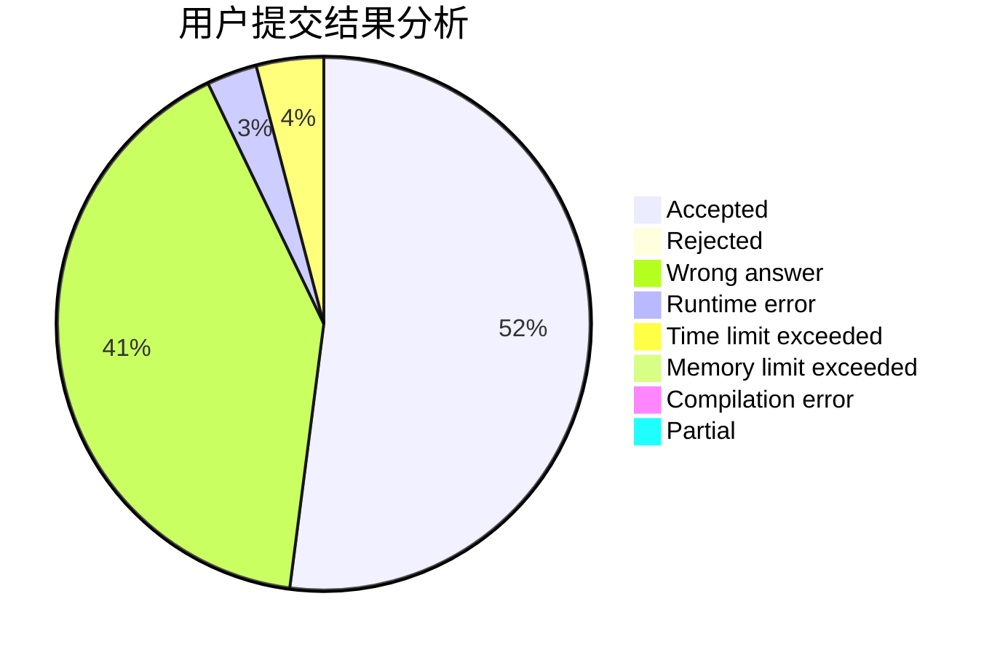
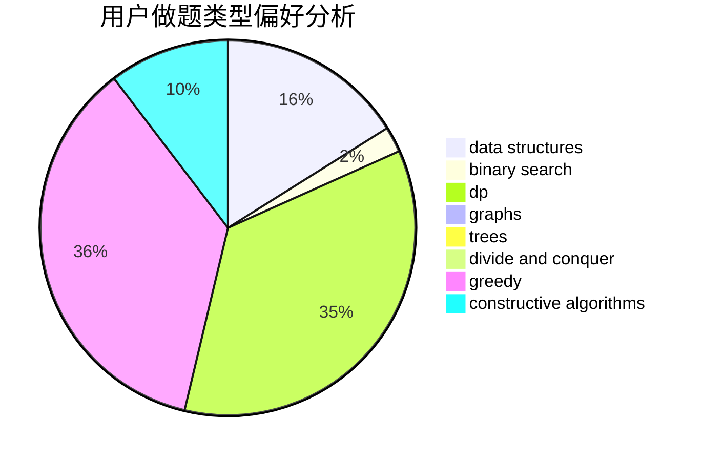
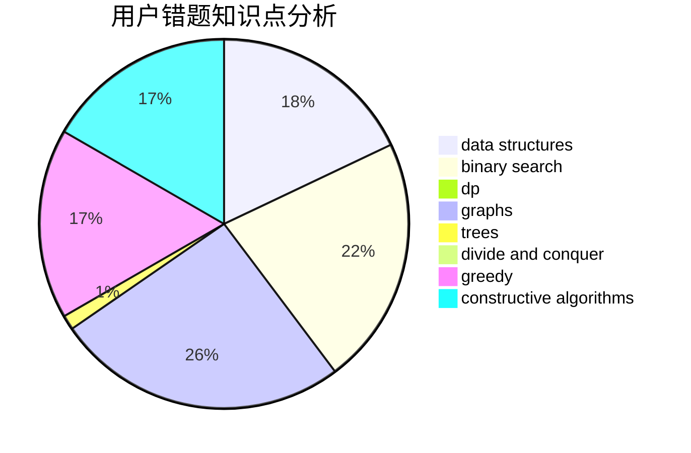

# lizzzzzzzzzz

<!-- tabs:start -->

#### **用户提交结果分析**

#### **用户做题类型偏好分析**

#### **用户错题知识点分析**

<!-- tabs:end -->
# 推荐题目
[1399F](https://codeforces.com/contest/1399/problem/F)		data structures,
                        dp,
                        graphs,
                        sortings		  
[543C](https://codeforces.com/contest/543/problem/C)		bitmasks,
                        dp		  
[877C](https://codeforces.com/contest/877/problem/C)		constructive algorithms		  
[1350D](https://codeforces.com/contest/1350/problem/D)		dsu,graphs,sortings,trees		  
[838F](https://codeforces.com/contest/838/problem/F)		nan		  
[1023A](https://codeforces.com/contest/1023/problem/A)		brute force,
                        implementation,
                        strings		  
[906A](https://codeforces.com/contest/906/problem/A)		implementation,
                        strings		  
[1060D](https://codeforces.com/contest/1060/problem/D)		greedy,
                        math		  
[856C](https://codeforces.com/contest/856/problem/C)		combinatorics,
                        dp,
                        math		  
[722F](https://codeforces.com/contest/722/problem/F)		chinese remainder theorem,
                        data structures,
                        implementation,
                        number theory,
                        two pointers		  
