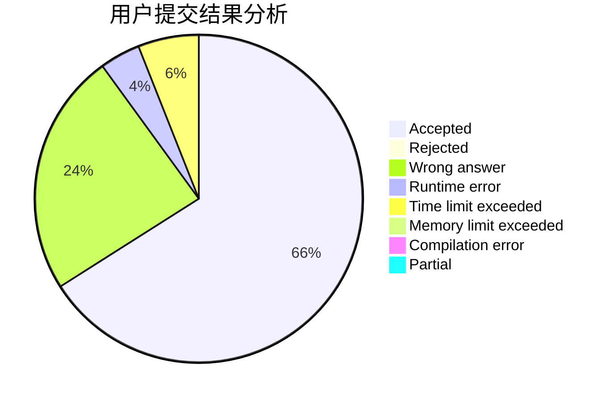
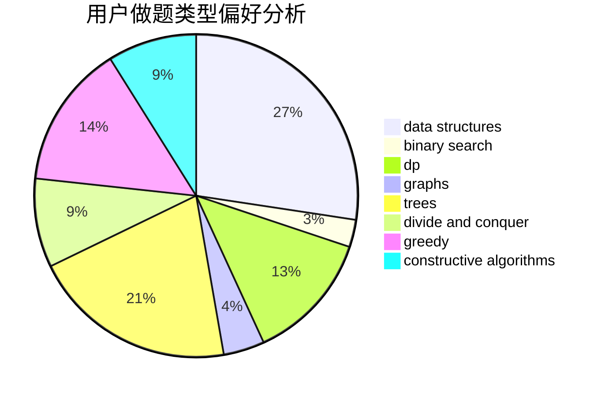

# ljc1301

<!-- tabs:start -->

#### **用户提交结果分析**

#### **用户做题类型偏好分析**

#### **用户错题知识点分析**

<!-- tabs:end -->
# 推荐题目
[274D](https://codeforces.com/contest/274/problem/D)		dfs and similar,
                        graphs,
                        greedy,
                        sortings		  
[705A](https://codeforces.com/contest/705/problem/A)		implementation		  
[547C](https://codeforces.com/contest/547/problem/C)		bitmasks,
                        combinatorics,
                        dp,
                        math,
                        number theory		  
[286B](https://codeforces.com/contest/286/problem/B)		implementation		  
[687A](https://codeforces.com/contest/687/problem/A)		dfs and similar,
                        graphs		  
[140C](https://codeforces.com/contest/140/problem/C)		binary search,
                        data structures,
                        greedy		  
[1169C](https://codeforces.com/contest/1169/problem/C)		dsu,graphs,sortings,trees		  
[883G](https://codeforces.com/contest/883/problem/G)		dfs and similar,
                        graphs		  
[1142C](https://codeforces.com/contest/1142/problem/C)		geometry		  
[1000E](https://codeforces.com/contest/1000/problem/E)		dfs and similar,
                        graphs,
                        trees		  
