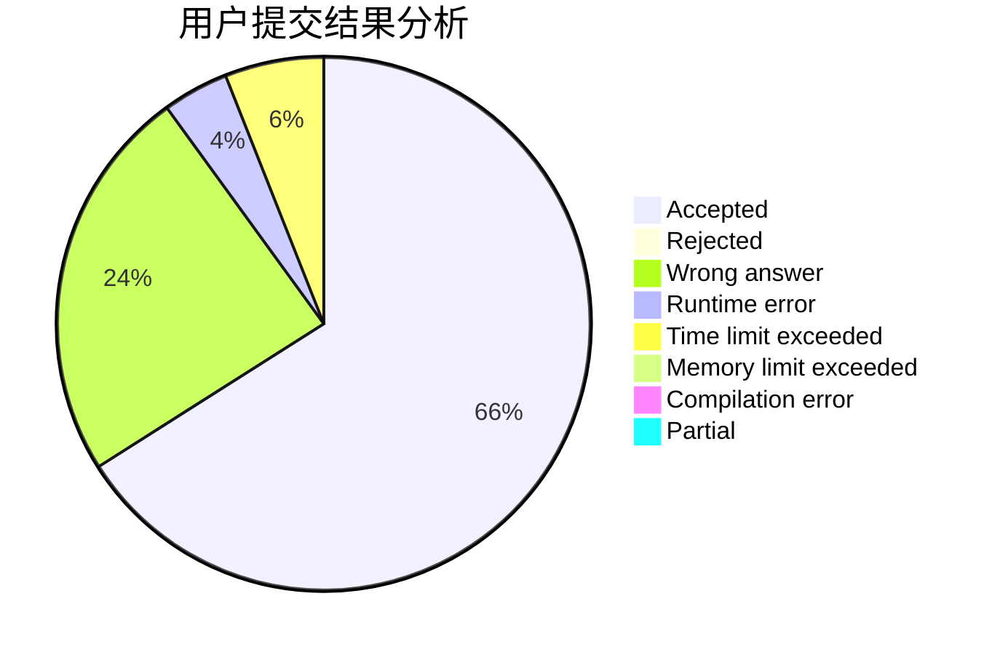
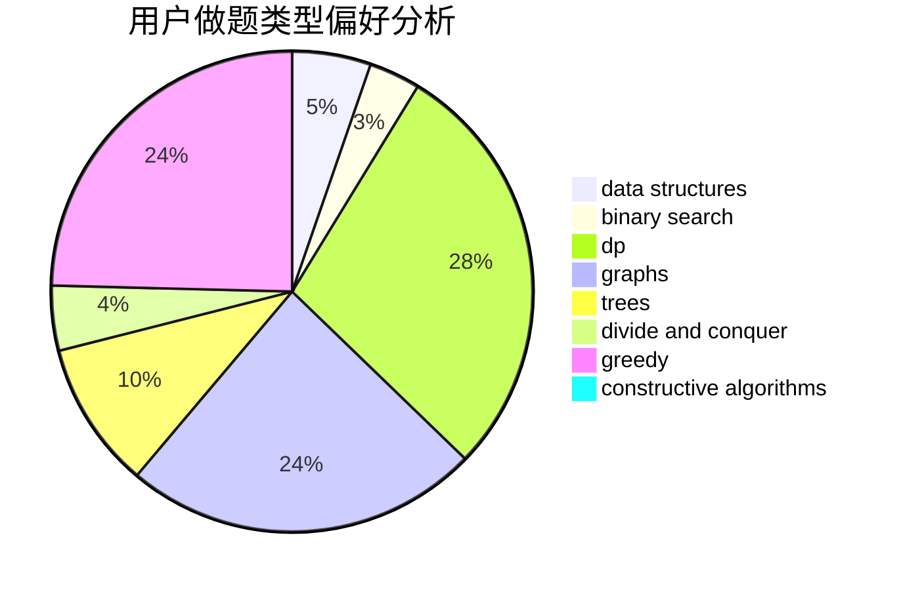

# ljc1301

<!-- tabs:start -->

#### **用户提交结果分析**

#### **用户做题类型偏好分析**

#### **用户错题知识点分析**

<!-- tabs:end -->
# 推荐题目
[257D](https://codeforces.com/contest/257/problem/D)		greedy,
                        math		  
[681B](https://codeforces.com/contest/681/problem/B)		brute force		  
[521D](https://codeforces.com/contest/521/problem/D)		greedy		  
[26A](https://codeforces.com/contest/26/problem/A)		number theory		  
[666A](https://codeforces.com/contest/666/problem/A)		dp,
                        implementation,
                        strings		  
[1400D](https://codeforces.com/contest/1400/problem/D)		brute force,
                        combinatorics,
                        data structures,
                        math,
                        two pointers		  
[1166D](https://codeforces.com/contest/1166/problem/D)		binary search,
                        brute force,
                        greedy,
                        math		  
[863E](https://codeforces.com/contest/863/problem/E)		data structures,
                        sortings		  
[1140E](https://codeforces.com/contest/1140/problem/E)		combinatorics,
                        divide and conquer,
                        dp		  
[1000E](https://codeforces.com/contest/1000/problem/E)		dfs and similar,
                        graphs,
                        trees		  
