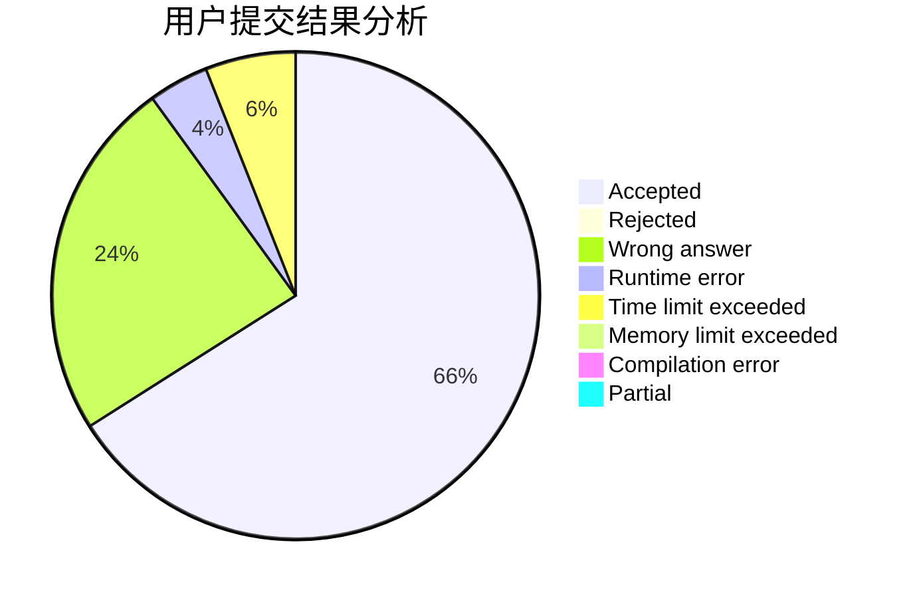
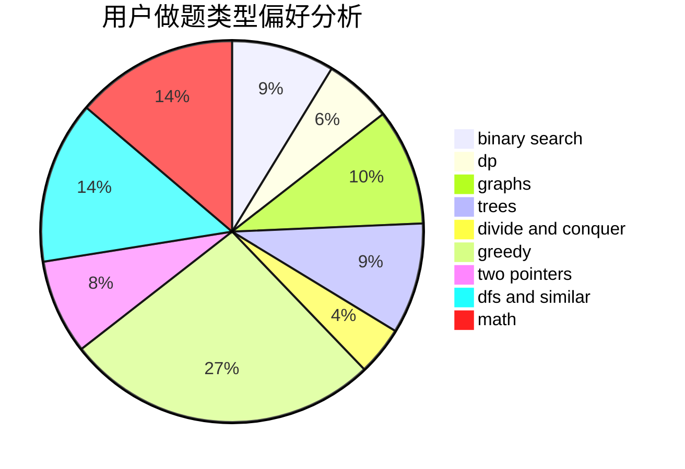

# ljc1301

<!-- tabs:start -->

#### **用户提交结果分析**

#### **用户做题类型偏好分析**

<!-- tabs:end -->
# 推荐题目
[274D](https://codeforces.com/contest/274/problem/D)
[705A](https://codeforces.com/contest/705/problem/A)
[547C](https://codeforces.com/contest/547/problem/C)
[286B](https://codeforces.com/contest/286/problem/B)
[687A](https://codeforces.com/contest/687/problem/A)
[140C](https://codeforces.com/contest/140/problem/C)
[1169C](https://codeforces.com/contest/1169/problem/C)
[883G](https://codeforces.com/contest/883/problem/G)
[1142C](https://codeforces.com/contest/1142/problem/C)
[1000E](https://codeforces.com/contest/1000/problem/E)
