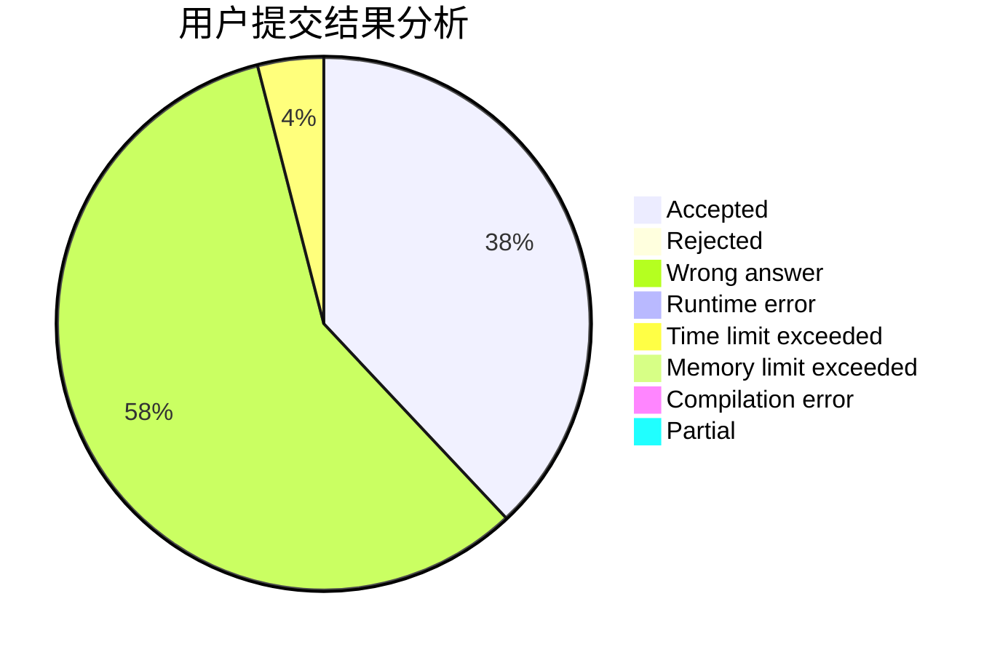
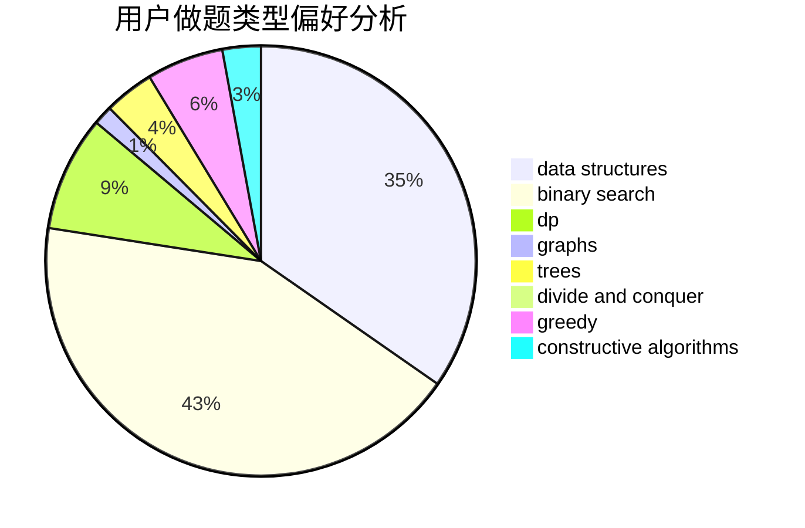

# ljjjjjjjq

<!-- tabs:start -->

#### **用户提交结果分析**

#### **用户做题类型偏好分析**

#### **用户错题知识点分析**

<!-- tabs:end -->
# 推荐题目
[121C](https://codeforces.com/contest/121/problem/C)		brute force,
                        combinatorics,
                        number theory		  
[1190C](https://codeforces.com/contest/1190/problem/C)		brute force,
                        games,
                        greedy		  
[1291D](https://codeforces.com/contest/1291/problem/D)		dsu,graphs,sortings,trees		  
[1354F](https://codeforces.com/contest/1354/problem/F)		constructive algorithms,
                        dp,
                        flows,
                        graph matchings,
                        greedy,
                        sortings		  
[766D](https://codeforces.com/contest/766/problem/D)		data structures,
                        dfs and similar,
                        dp,
                        dsu,
                        graphs		  
[1133A](https://codeforces.com/contest/1133/problem/A)		implementation		  
[535A](https://codeforces.com/contest/535/problem/A)		brute force,
                        implementation		  
[201C](https://codeforces.com/contest/201/problem/C)		dp		  
[566A](https://codeforces.com/contest/566/problem/A)		dfs and similar,
                        strings,
                        trees		  
[1464E](https://codeforces.com/contest/1464/problem/E)		dsu,graphs,sortings,trees		  
