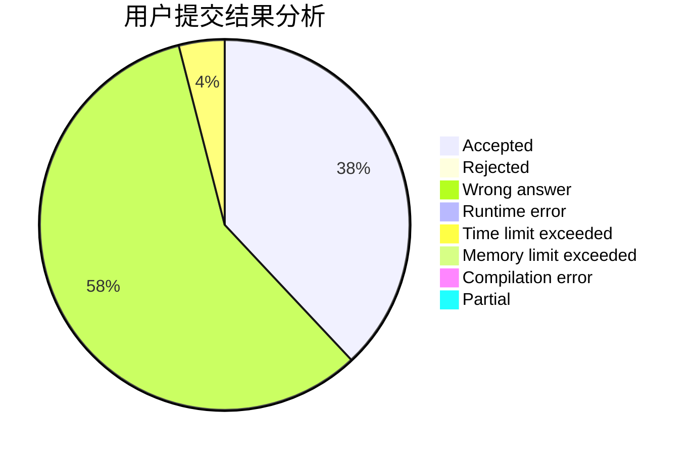
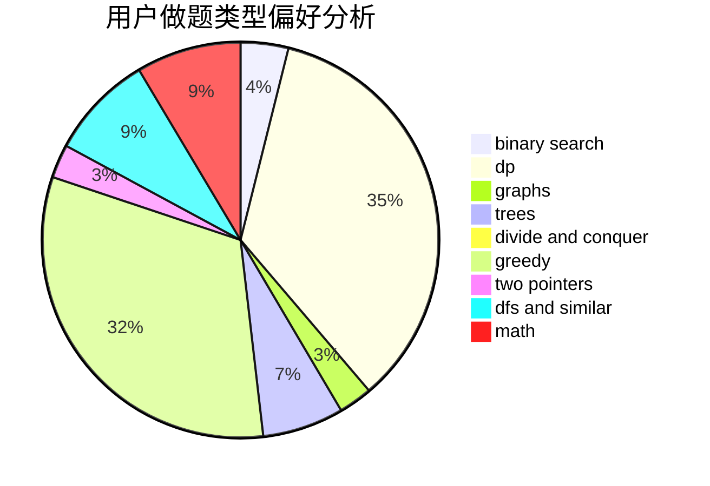

# ljjjjjjjq

<!-- tabs:start -->

#### **用户提交结果分析**

#### **用户做题类型偏好分析**

<!-- tabs:end -->
# 推荐题目
[1227A](https://codeforces.com/contest/1227/problem/A)
[1196A](https://codeforces.com/contest/1196/problem/A)
[1298C](https://codeforces.com/contest/1298/problem/C)
[1361C](https://codeforces.com/contest/1361/problem/C)
[786A](https://codeforces.com/contest/786/problem/A)
[1137B](https://codeforces.com/contest/1137/problem/B)
[557C](https://codeforces.com/contest/557/problem/C)
[226B](https://codeforces.com/contest/226/problem/B)
[584E](https://codeforces.com/contest/584/problem/E)
[1471F](https://codeforces.com/contest/1471/problem/F)
