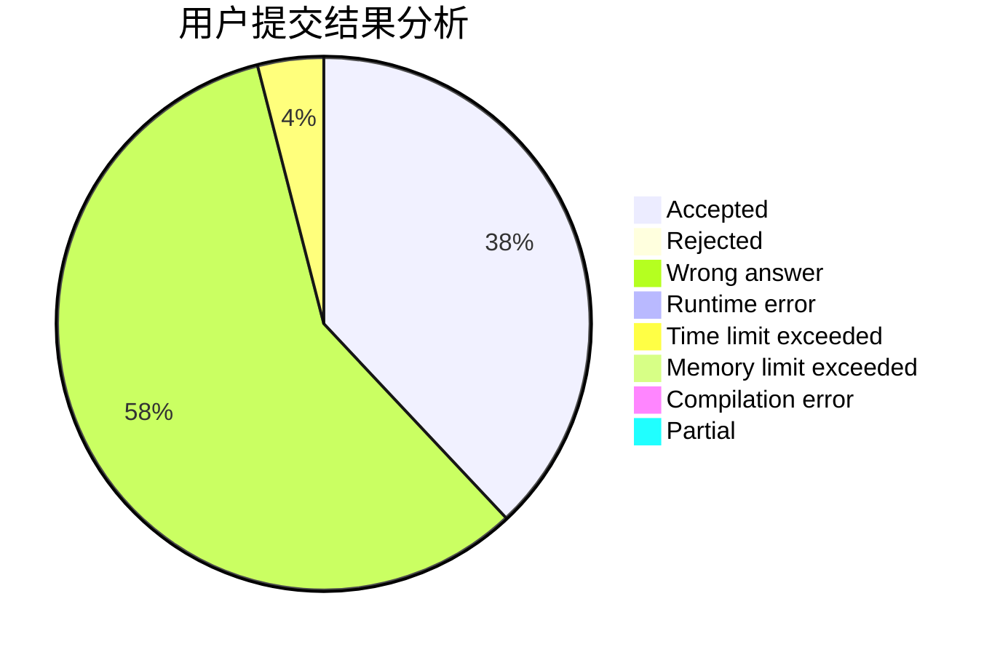
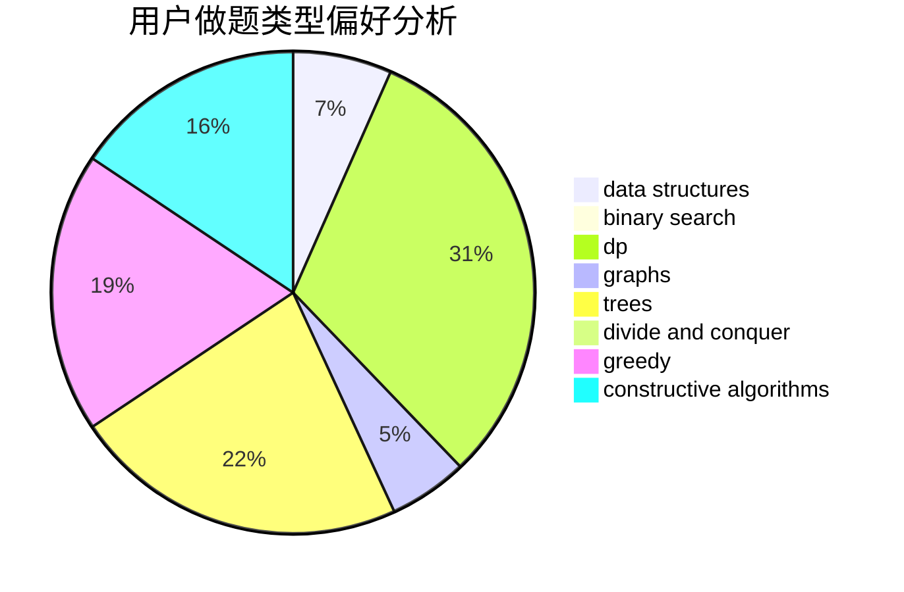

# ljjjjjjjq

<!-- tabs:start -->

#### **用户提交结果分析**

#### **用户做题类型偏好分析**

#### **用户错题知识点分析**

<!-- tabs:end -->
# 推荐题目
[1227A](https://codeforces.com/contest/1227/problem/A)		math		  
[1196A](https://codeforces.com/contest/1196/problem/A)		brute force,
                        constructive algorithms,
                        math		  
[1298C](https://codeforces.com/contest/1298/problem/C)		dsu,graphs,sortings,trees		  
[1361C](https://codeforces.com/contest/1361/problem/C)		binary search,
                        bitmasks,
                        constructive algorithms,
                        dfs and similar,
                        dsu,
                        graphs		  
[786A](https://codeforces.com/contest/786/problem/A)		dfs and similar,
                        dp,
                        games		  
[1137B](https://codeforces.com/contest/1137/problem/B)		greedy,
                        hashing,
                        strings		  
[557C](https://codeforces.com/contest/557/problem/C)		brute force,
                        data structures,
                        dp,
                        greedy,
                        math,
                        sortings		  
[226B](https://codeforces.com/contest/226/problem/B)		greedy		  
[584E](https://codeforces.com/contest/584/problem/E)		constructive algorithms,
                        greedy,
                        math		  
[1471F](https://codeforces.com/contest/1471/problem/F)		dsu,graphs,sortings,trees		  
