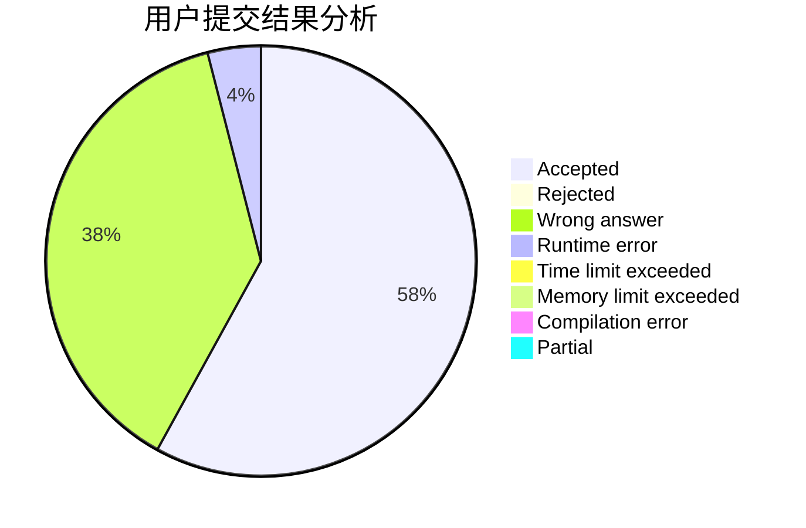
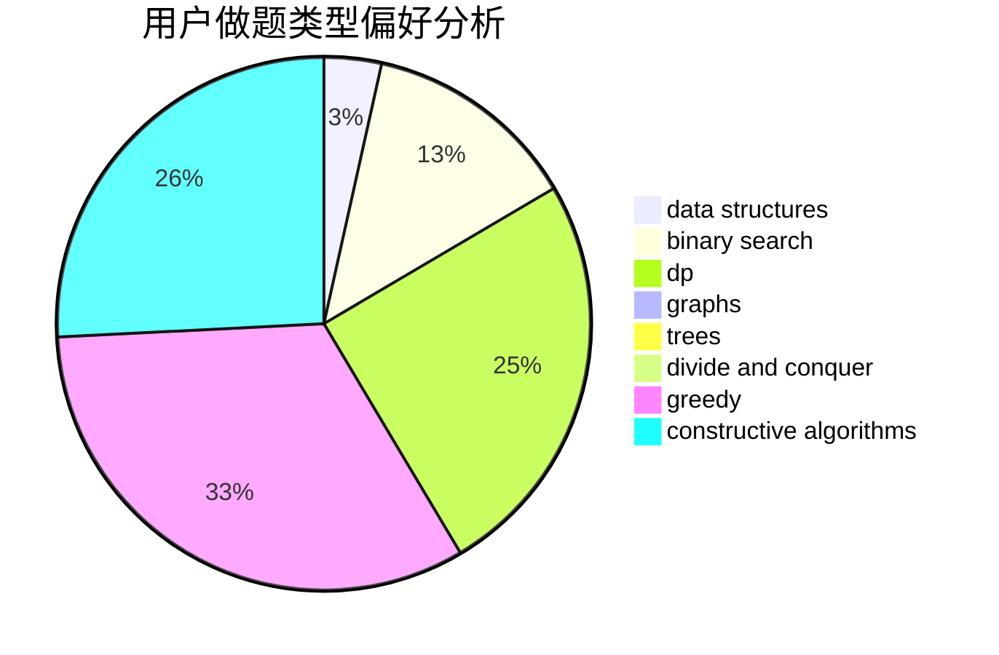

# ljq_hhh

<!-- tabs:start -->

#### **用户提交结果分析**

#### **用户做题类型偏好分析**

#### **用户错题知识点分析**

<!-- tabs:end -->
# 推荐题目
[1459D](https://codeforces.com/contest/1459/problem/D)		dsu,graphs,sortings,trees		  
[1000A](https://codeforces.com/contest/1000/problem/A)		greedy,
                        implementation		  
[580D](https://codeforces.com/contest/580/problem/D)		bitmasks,
                        dp		  
[843A](https://codeforces.com/contest/843/problem/A)		dfs and similar,
                        dsu,
                        implementation,
                        math,
                        sortings		  
[716A](https://codeforces.com/contest/716/problem/A)		implementation		  
[13573](https://codeforces.com/contest/1357/problem/3)		dsu,graphs,sortings,trees		  
[241E](https://codeforces.com/contest/241/problem/E)		graphs,
                        shortest paths		  
[1175D](https://codeforces.com/contest/1175/problem/D)		greedy,
                        sortings		  
[1359E](https://codeforces.com/contest/1359/problem/E)		combinatorics,
                        math,
                        number theory		  
[442E](https://codeforces.com/contest/442/problem/E)		geometry		  
