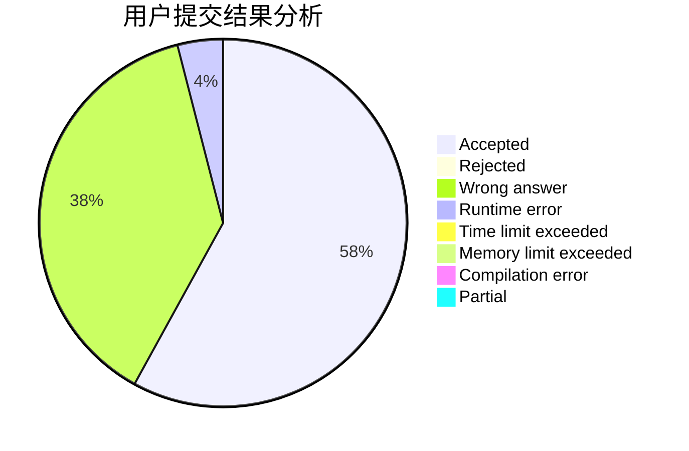
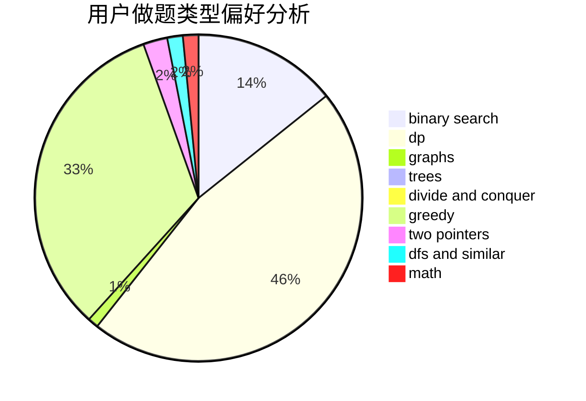

# ljq_hhh

<!-- tabs:start -->

#### **用户提交结果分析**

#### **用户做题类型偏好分析**

<!-- tabs:end -->
# 推荐题目
[1459D](https://codeforces.com/contest/1459/problem/D)
[1000A](https://codeforces.com/contest/1000/problem/A)
[580D](https://codeforces.com/contest/580/problem/D)
[843A](https://codeforces.com/contest/843/problem/A)
[716A](https://codeforces.com/contest/716/problem/A)
[13573](https://codeforces.com/contest/1357/problem/3)
[241E](https://codeforces.com/contest/241/problem/E)
[1175D](https://codeforces.com/contest/1175/problem/D)
[1359E](https://codeforces.com/contest/1359/problem/E)
[442E](https://codeforces.com/contest/442/problem/E)
