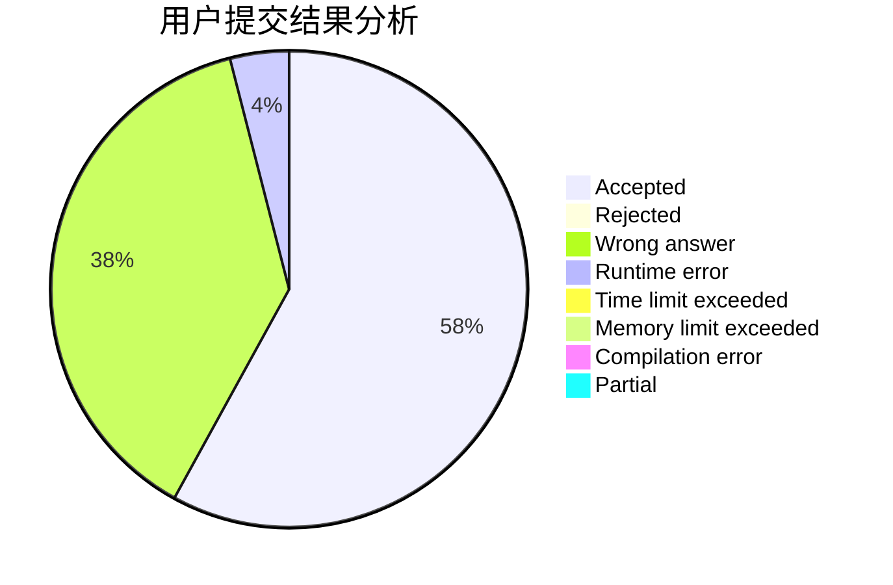
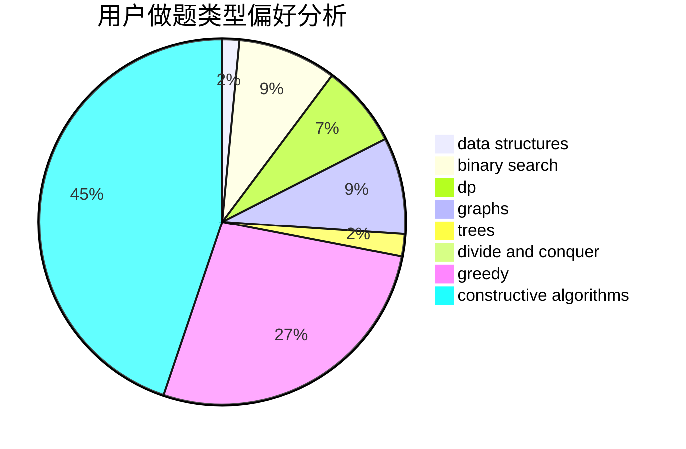

# ljq_hhh

<!-- tabs:start -->

#### **用户提交结果分析**

#### **用户做题类型偏好分析**

#### **用户错题知识点分析**

<!-- tabs:end -->
# 推荐题目
[1450G](https://codeforces.com/contest/1450/problem/G)		bitmasks,
                        dp,
                        trees		  
[1000A](https://codeforces.com/contest/1000/problem/A)		greedy,
                        implementation		  
[557C](https://codeforces.com/contest/557/problem/C)		brute force,
                        data structures,
                        dp,
                        greedy,
                        math,
                        sortings		  
[825A](https://codeforces.com/contest/825/problem/A)		implementation		  
[699B](https://codeforces.com/contest/699/problem/B)		implementation		  
[134B](https://codeforces.com/contest/134/problem/B)		brute force,
                        dfs and similar,
                        math,
                        number theory		  
[223C](https://codeforces.com/contest/223/problem/C)		combinatorics,
                        math,
                        number theory		  
[1173A](https://codeforces.com/contest/1173/problem/A)		greedy		  
[1352G](https://codeforces.com/contest/1352/problem/G)		constructive algorithms		  
[418A](https://codeforces.com/contest/418/problem/A)		dsu,graphs,sortings,trees		  
