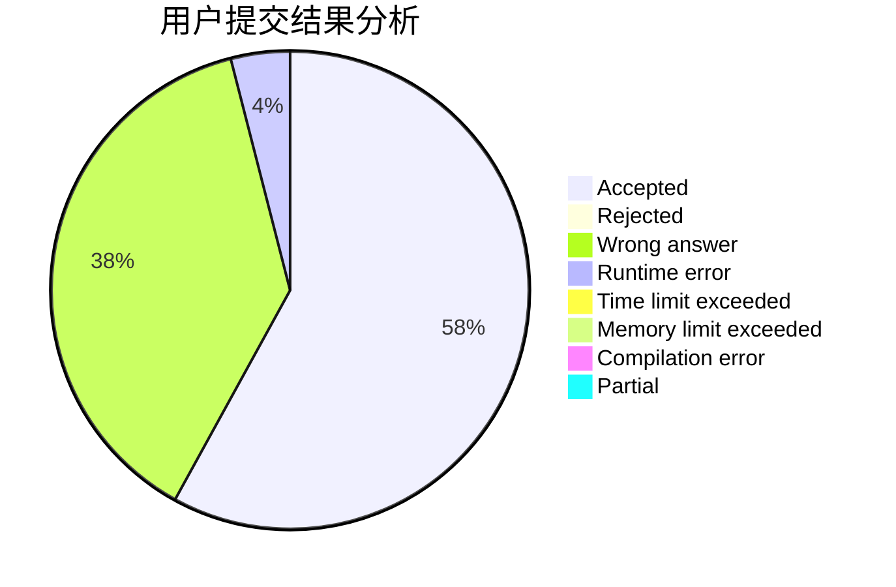
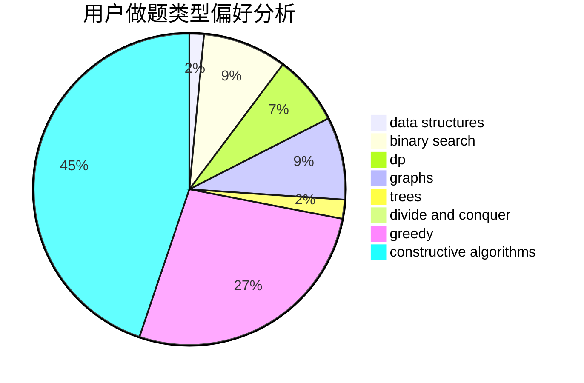

# ljq_hhh
<!-- tabs:start -->
#### **用户提交结果分析**

#### **用户做题类型偏好分析**

#### **用户错题知识点分析**

<!-- tabs:end -->
# 推荐题目
[EhAb AnD gCd](http://codeforces.com/problemset/problem/1325/A)		constructive algorithms,
                        greedy,
                        number theory		  
[Binary Protocol](http://codeforces.com/problemset/problem/825/A)		implementation		  
[k-Amazing Numbers](http://codeforces.com/problemset/problem/1416/A)		binary search,
                        data structures,
                        implementation,
                        two pointers		  
[Codehorses T-shirts](http://codeforces.com/problemset/problem/1000/A)		greedy,
                        implementation		  
[Arthur and Table](http://codeforces.com/problemset/problem/557/C)		brute force,
                        data structures,
                        dp,
                        greedy,
                        math,
                        sortings		  
[Peculiar apple-tree](https://codeforces.com/contest/931/problem/D)		dfs and similar,
                        graphs,
                        trees		  
[Pairs of Numbers](http://codeforces.com/problemset/problem/134/B)		brute force,
                        dfs and similar,
                        math,
                        number theory		  
[One Bomb](http://codeforces.com/problemset/problem/699/B)		implementation		  
[Insomnia cure](http://codeforces.com/problemset/problem/148/A)		constructive algorithms,
                        implementation,
                        math		  
[Hamburgers](http://codeforces.com/problemset/problem/371/C)		binary search,
                        brute force		  
<!-- tabs:start -->
#### **data structures**
[EhAb AnD gCd](http://codeforces.com/problemset/problem/1416/A)		binary search,
                        data structures,
                        implementation,
                        two pointers		  
[Binary Protocol](http://codeforces.com/problemset/problem/557/C)		brute force,
                        data structures,
                        dp,
                        greedy,
                        math,
                        sortings		  
[k-Amazing Numbers](http://codeforces.com/problemset/problem/1335/F)		data structures,
                        dfs and similar,
                        dsu,
                        graphs,
                        greedy,
                        matrices		  
[Codehorses T-shirts](http://codeforces.com/problemset/problem/551/E)		binary search,
                        data structures,
                        implementation		  
[Arthur and Table](http://codeforces.com/problemset/problem/494/D)		data structures,
                        dfs and similar,
                        dp,
                        trees		  
[Peculiar apple-tree](http://codeforces.com/problemset/problem/1380/E)		data structures,
                        dsu,
                        implementation,
                        trees		  
[Pairs of Numbers](http://codeforces.com/problemset/problem/1100/B)		data structures,
                        implementation		  
[One Bomb](http://codeforces.com/problemset/problem/576/E)		binary search,
                        data structures		  
[Insomnia cure](http://codeforces.com/problemset/problem/1368/G)		data structures,
                        geometry,
                        graphs,
                        trees		  
[Hamburgers](http://codeforces.com/problemset/problem/1492/C)		binary search,
                        data structures,
                        dp,
                        greedy,
                        two pointers		  
#### **binary search**
[EhAb AnD gCd](http://codeforces.com/problemset/problem/1416/A)		binary search,
                        data structures,
                        implementation,
                        two pointers		  
[Binary Protocol](http://codeforces.com/problemset/problem/371/C)		binary search,
                        brute force		  
[k-Amazing Numbers](http://codeforces.com/problemset/problem/551/E)		binary search,
                        data structures,
                        implementation		  
[Codehorses T-shirts](http://codeforces.com/problemset/problem/1118/D2)		binary search,
                        greedy		  
[Arthur and Table](http://codeforces.com/problemset/problem/576/E)		binary search,
                        data structures		  
[Peculiar apple-tree](http://codeforces.com/problemset/problem/1492/C)		binary search,
                        data structures,
                        dp,
                        greedy,
                        two pointers		  
[Pairs of Numbers](http://codeforces.com/problemset/problem/1463/D)		binary search,
                        constructive algorithms,
                        greedy,
                        two pointers		  
[One Bomb](http://codeforces.com/problemset/problem/1490/G)		binary search,
                        data structures,
                        math		  
[Insomnia cure](http://codeforces.com/problemset/problem/1479/D)		binary search,
                        bitmasks,
                        brute force,
                        data structures,
                        probabilities,
                        trees		  
[Hamburgers](http://codeforces.com/problemset/problem/1436/E)		binary search,
                        data structures,
                        two pointers		  
#### **dp**
[EhAb AnD gCd](http://codeforces.com/problemset/problem/557/C)		brute force,
                        data structures,
                        dp,
                        greedy,
                        math,
                        sortings		  
[Binary Protocol](http://codeforces.com/problemset/problem/718/D)		dp,
                        hashing,
                        trees		  
[k-Amazing Numbers](https://codeforces.com/contest/1240/problem/C)		brute force,
                        constructive algorithms,
                        dp,
                        graphs,
                        implementation,
                        trees		  
[Codehorses T-shirts](http://codeforces.com/problemset/problem/567/F)		dp		  
[Arthur and Table](http://codeforces.com/problemset/problem/513/E1)		dp		  
[Peculiar apple-tree](http://codeforces.com/problemset/problem/494/D)		data structures,
                        dfs and similar,
                        dp,
                        trees		  
[Pairs of Numbers](http://codeforces.com/problemset/problem/1245/F)		bitmasks,
                        brute force,
                        combinatorics,
                        dp		  
[One Bomb](http://codeforces.com/problemset/problem/1324/E)		dp,
                        implementation		  
[Insomnia cure](http://codeforces.com/problemset/problem/346/D)		dp,
                        graphs,
                        shortest paths		  
[Hamburgers](http://codeforces.com/problemset/problem/1450/G)		bitmasks,
                        dp,
                        trees		  
#### **graph**
[EhAb AnD gCd](https://codeforces.com/contest/931/problem/D)		dfs and similar,
                        graphs,
                        trees		  
[Binary Protocol](http://codeforces.com/problemset/problem/1335/F)		data structures,
                        dfs and similar,
                        dsu,
                        graphs,
                        greedy,
                        matrices		  
[k-Amazing Numbers](https://codeforces.com/contest/1240/problem/C)		brute force,
                        constructive algorithms,
                        dp,
                        graphs,
                        implementation,
                        trees		  
[Codehorses T-shirts](https://codeforces.com/contest/1341/problem/F)		constructive algorithms,
                        dfs and similar,
                        graphs,
                        trees		  
[Arthur and Table](http://codeforces.com/problemset/problem/567/E)		dfs and similar,
                        graphs,
                        hashing,
                        shortest paths		  
[Peculiar apple-tree](http://codeforces.com/problemset/problem/802/J)		dfs and similar,
                        graphs,
                        trees		  
[Pairs of Numbers](http://codeforces.com/problemset/problem/612/E)		combinatorics,
                        constructive algorithms,
                        dfs and similar,
                        graphs,
                        math		  
[One Bomb](https://codeforces.com/contest/418/problem/A)		graphs		  
[Insomnia cure](http://codeforces.com/problemset/problem/1006/E)		dfs and similar,
                        graphs,
                        trees		  
[Hamburgers](http://codeforces.com/problemset/problem/346/D)		dp,
                        graphs,
                        shortest paths		  
#### **trees**
[EhAb AnD gCd](https://codeforces.com/contest/931/problem/D)		dfs and similar,
                        graphs,
                        trees		  
[Binary Protocol](http://codeforces.com/problemset/problem/718/D)		dp,
                        hashing,
                        trees		  
[k-Amazing Numbers](https://codeforces.com/contest/1240/problem/C)		brute force,
                        constructive algorithms,
                        dp,
                        graphs,
                        implementation,
                        trees		  
[Codehorses T-shirts](http://codeforces.com/problemset/problem/494/D)		data structures,
                        dfs and similar,
                        dp,
                        trees		  
[Arthur and Table](https://codeforces.com/contest/1341/problem/F)		constructive algorithms,
                        dfs and similar,
                        graphs,
                        trees		  
[Peculiar apple-tree](http://codeforces.com/problemset/problem/1380/E)		data structures,
                        dsu,
                        implementation,
                        trees		  
[Pairs of Numbers](http://codeforces.com/problemset/problem/802/J)		dfs and similar,
                        graphs,
                        trees		  
[One Bomb](http://codeforces.com/problemset/problem/1006/E)		dfs and similar,
                        graphs,
                        trees		  
[Insomnia cure](http://codeforces.com/problemset/problem/1368/G)		data structures,
                        geometry,
                        graphs,
                        trees		  
[Hamburgers](http://codeforces.com/problemset/problem/1450/G)		bitmasks,
                        dp,
                        trees		  
#### **divide and conquer**
[EhAb AnD gCd](http://codeforces.com/problemset/problem/1491/E)		brute force,
                        dfs and similar,
                        divide and conquer,
                        number theory,
                        trees		  
[Binary Protocol](http://codeforces.com/problemset/problem/1461/D)		binary search,
                        brute force,
                        data structures,
                        divide and conquer,
                        implementation,
                        sortings		  
[k-Amazing Numbers](http://codeforces.com/problemset/problem/1466/G)		combinatorics,
                        divide and conquer,
                        hashing,
                        math,
                        string suffix structures,
                        strings		  
[Codehorses T-shirts](http://codeforces.com/problemset/problem/1490/D)		dfs and similar,
                        divide and conquer,
                        implementation		  
[Arthur and Table](https://codeforces.com/contest/1483/problem/C)		data structures,
                        divide and conquer,
                        dp		  
[Peculiar apple-tree](http://codeforces.com/problemset/problem/1491/E)		brute force,
                        dfs and similar,
                        divide and conquer,
                        number theory,
                        trees		  
[Pairs of Numbers](http://codeforces.com/problemset/problem/1303/G)		data structures,
                        divide and conquer,
                        geometry,
                        trees		  
[One Bomb](http://codeforces.com/problemset/problem/1494/D)		constructive algorithms,
                        data structures,
                        dfs and similar,
                        divide and conquer,
                        dsu,
                        greedy,
                        sortings,
                        trees		  
[Insomnia cure](http://codeforces.com/problemset/problem/1482/E)		data structures,
                        divide and conquer,
                        dp		  
[Hamburgers](http://codeforces.com/problemset/problem/566/C)		dfs and similar,
                        divide and conquer,
                        trees		  
#### **greedy**
[EhAb AnD gCd](http://codeforces.com/problemset/problem/1325/A)		constructive algorithms,
                        greedy,
                        number theory		  
[Binary Protocol](http://codeforces.com/problemset/problem/1000/A)		greedy,
                        implementation		  
[k-Amazing Numbers](http://codeforces.com/problemset/problem/557/C)		brute force,
                        data structures,
                        dp,
                        greedy,
                        math,
                        sortings		  
[Codehorses T-shirts](http://codeforces.com/problemset/problem/246/B)		greedy,
                        math		  
[Arthur and Table](http://codeforces.com/problemset/problem/1173/A)		greedy		  
[Peculiar apple-tree](http://codeforces.com/problemset/problem/1335/F)		data structures,
                        dfs and similar,
                        dsu,
                        graphs,
                        greedy,
                        matrices		  
[Pairs of Numbers](http://codeforces.com/problemset/problem/258/A)		greedy,
                        math		  
[One Bomb](http://codeforces.com/problemset/problem/785/B)		greedy,
                        sortings		  
[Insomnia cure](http://codeforces.com/problemset/problem/1118/D2)		binary search,
                        greedy		  
[Hamburgers](http://codeforces.com/problemset/problem/765/B)		greedy,
                        implementation,
                        strings		  
#### **constructive algorithms**
[EhAb AnD gCd](http://codeforces.com/problemset/problem/1325/A)		constructive algorithms,
                        greedy,
                        number theory		  
[Binary Protocol](http://codeforces.com/problemset/problem/148/A)		constructive algorithms,
                        implementation,
                        math		  
[k-Amazing Numbers](https://codeforces.com/contest/1240/problem/C)		brute force,
                        constructive algorithms,
                        dp,
                        graphs,
                        implementation,
                        trees		  
[Codehorses T-shirts](https://codeforces.com/contest/1341/problem/F)		constructive algorithms,
                        dfs and similar,
                        graphs,
                        trees		  
[Arthur and Table](http://codeforces.com/problemset/problem/612/E)		combinatorics,
                        constructive algorithms,
                        dfs and similar,
                        graphs,
                        math		  
[Peculiar apple-tree](http://codeforces.com/problemset/problem/613/C)		constructive algorithms,
                        math		  
[Pairs of Numbers](http://codeforces.com/problemset/problem/1352/G)		constructive algorithms		  
[One Bomb](http://codeforces.com/problemset/problem/1063/A)		constructive algorithms,
                        strings		  
[Insomnia cure](http://codeforces.com/problemset/problem/482/A)		constructive algorithms,
                        greedy		  
[Hamburgers](http://codeforces.com/problemset/problem/1364/D)		constructive algorithms,
                        dfs and similar,
                        graphs,
                        greedy,
                        implementation,
                        trees		  
#### **sortings**
[EhAb AnD gCd](http://codeforces.com/problemset/problem/557/C)		brute force,
                        data structures,
                        dp,
                        greedy,
                        math,
                        sortings		  
[Binary Protocol](http://codeforces.com/problemset/problem/845/A)		implementation,
                        sortings		  
[k-Amazing Numbers](http://codeforces.com/problemset/problem/785/B)		greedy,
                        sortings		  
[Codehorses T-shirts](http://codeforces.com/problemset/problem/1297/B)		*special problem,
                        implementation,
                        sortings		  
[Arthur and Table](http://codeforces.com/problemset/problem/1117/B)		greedy,
                        math,
                        sortings		  
[Peculiar apple-tree](https://codeforces.com/contest/1496/problem/C)		geometry,
                        greedy,
                        math,
                        sortings		  
[Pairs of Numbers](http://codeforces.com/problemset/problem/1495/A)		geometry,
                        greedy,
                        math,
                        sortings		  
[One Bomb](http://codeforces.com/problemset/problem/1497/A)		brute force,
                        data structures,
                        greedy,
                        sortings		  
[Insomnia cure](http://codeforces.com/problemset/problem/1427/A)		math,
                        sortings		  
[Hamburgers](http://codeforces.com/problemset/problem/1461/D)		binary search,
                        brute force,
                        data structures,
                        divide and conquer,
                        implementation,
                        sortings		  
<!-- tabs:end -->
