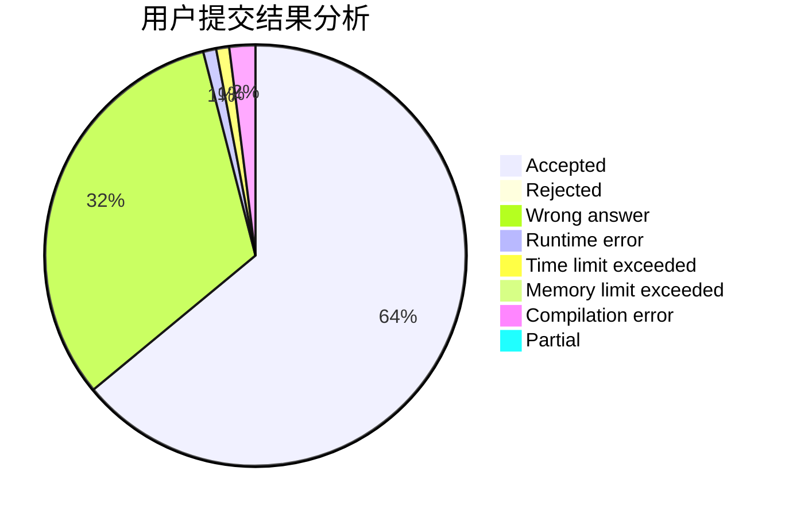
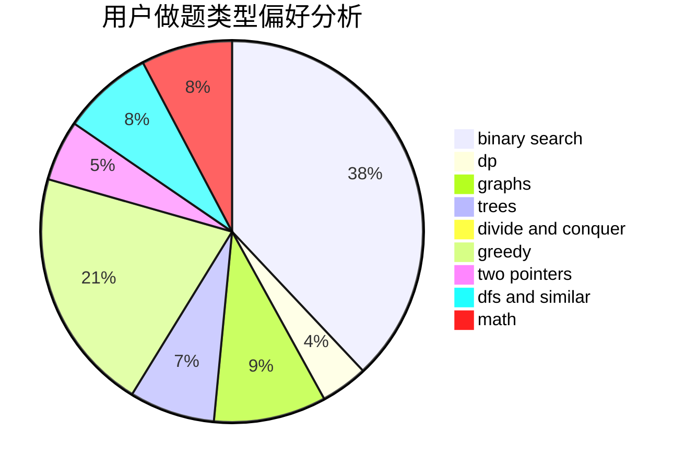

# ljr1234

<!-- tabs:start -->

#### **用户提交结果分析**

#### **用户做题类型偏好分析**

<!-- tabs:end -->
# 推荐题目
[1513B](https://codeforces.com/contest/1513/problem/B)
[1436E](https://codeforces.com/contest/1436/problem/E)
[52A](https://codeforces.com/contest/52/problem/A)
[498C](https://codeforces.com/contest/498/problem/C)
[990A](https://codeforces.com/contest/990/problem/A)
[11852](https://codeforces.com/contest/1185/problem/2)
[380A](https://codeforces.com/contest/380/problem/A)
[414B](https://codeforces.com/contest/414/problem/B)
[1202D](https://codeforces.com/contest/1202/problem/D)
[418C](https://codeforces.com/contest/418/problem/C)
