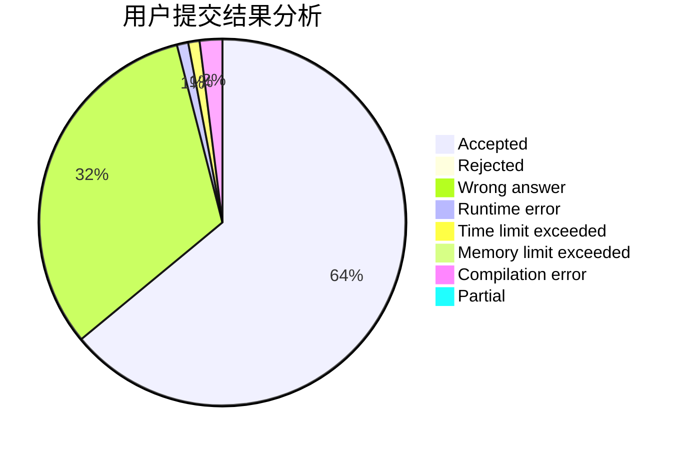
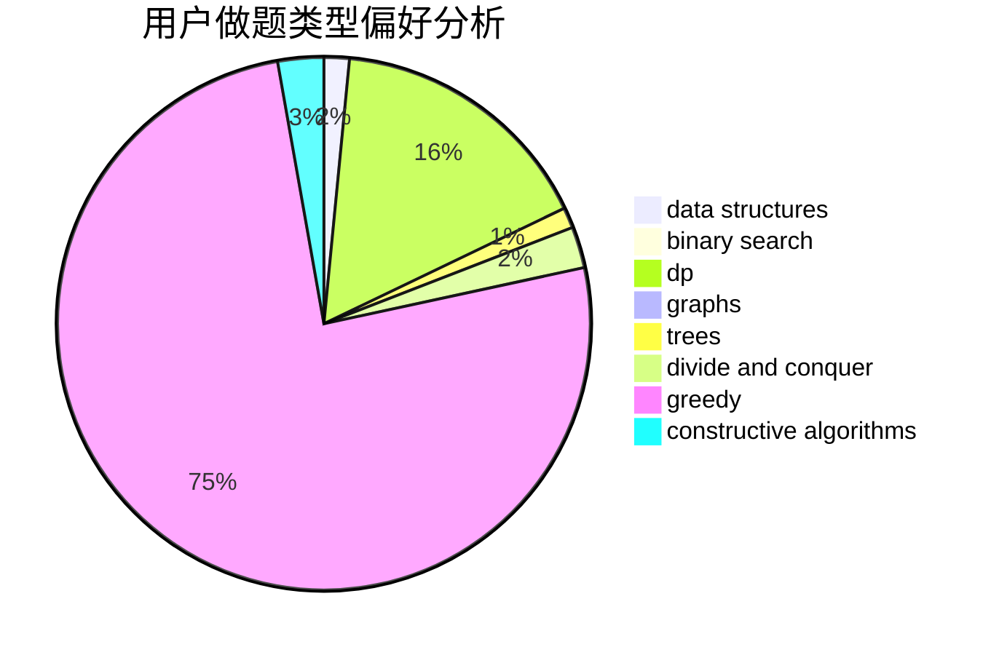
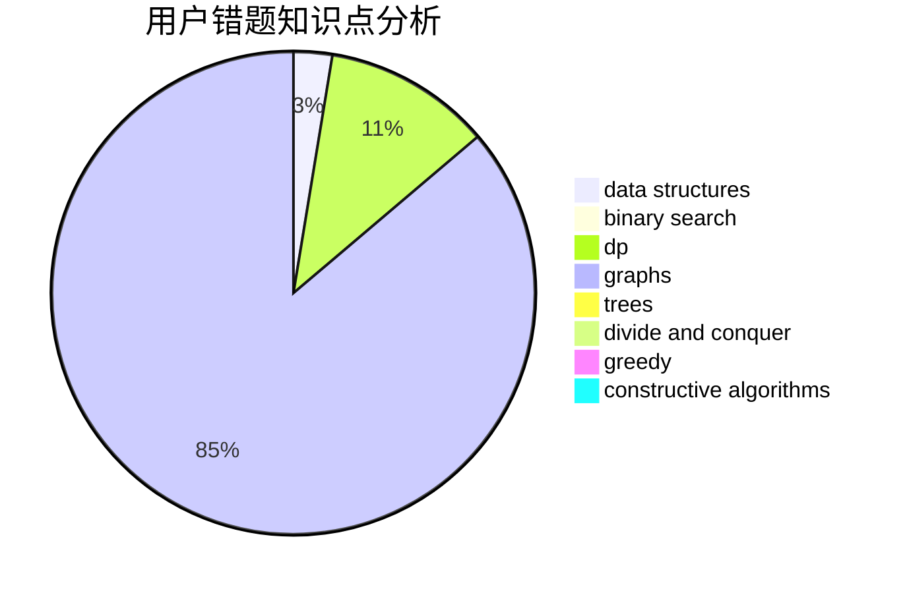

# ljr1234

<!-- tabs:start -->

#### **用户提交结果分析**

#### **用户做题类型偏好分析**

#### **用户错题知识点分析**

<!-- tabs:end -->
# 推荐题目
[1504C](https://codeforces.com/contest/1504/problem/C)		dsu,graphs,sortings,trees		  
[1427G](https://codeforces.com/contest/1427/problem/G)		flows,
                        graphs		  
[509A](https://codeforces.com/contest/509/problem/A)		brute force,
                        implementation		  
[478C](https://codeforces.com/contest/478/problem/C)		greedy		  
[976B](https://codeforces.com/contest/976/problem/B)		implementation,
                        math		  
[1182D](https://codeforces.com/contest/1182/problem/D)		constructive algorithms,
                        dfs and similar,
                        dp,
                        hashing,
                        implementation,
                        trees		  
[354B](https://codeforces.com/contest/354/problem/B)		bitmasks,
                        dp,
                        games		  
[383A](https://codeforces.com/contest/383/problem/A)		data structures,
                        greedy		  
[1198F](https://codeforces.com/contest/1198/problem/F)		greedy,
                        number theory,
                        probabilities		  
[389A](https://codeforces.com/contest/389/problem/A)		greedy,
                        math		  
