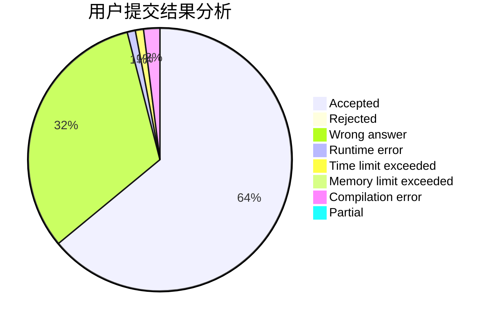
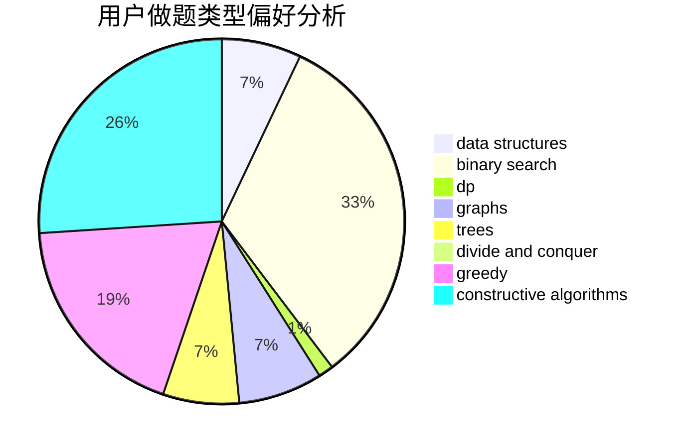
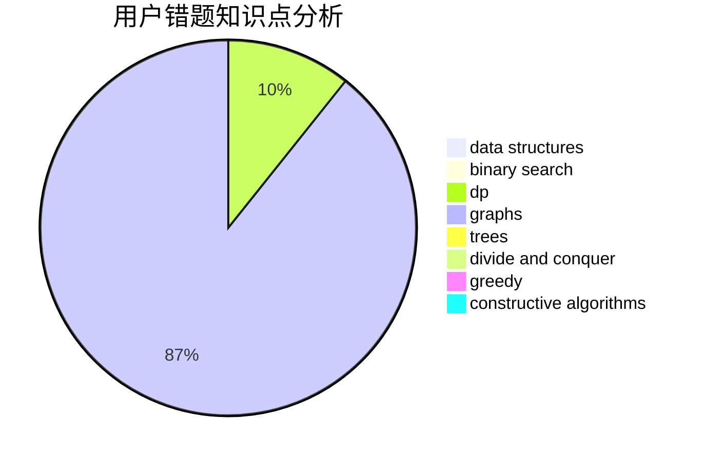

# ljr1234

<!-- tabs:start -->

#### **用户提交结果分析**

#### **用户做题类型偏好分析**

#### **用户错题知识点分析**

<!-- tabs:end -->
# 推荐题目
[1513B](https://codeforces.com/contest/1513/problem/B)		bitmasks,
                        combinatorics,
                        constructive algorithms,
                        math		  
[1436E](https://codeforces.com/contest/1436/problem/E)		binary search,
                        data structures,
                        two pointers		  
[52A](https://codeforces.com/contest/52/problem/A)		implementation		  
[498C](https://codeforces.com/contest/498/problem/C)		flows,
                        graph matchings,
                        number theory		  
[990A](https://codeforces.com/contest/990/problem/A)		implementation,
                        math		  
[11852](https://codeforces.com/contest/1185/problem/2)		dsu,graphs,sortings,trees		  
[380A](https://codeforces.com/contest/380/problem/A)		binary search,
                        brute force		  
[414B](https://codeforces.com/contest/414/problem/B)		combinatorics,
                        dp,
                        number theory		  
[1202D](https://codeforces.com/contest/1202/problem/D)		combinatorics,
                        constructive algorithms,
                        math,
                        strings		  
[418C](https://codeforces.com/contest/418/problem/C)		dsu,graphs,sortings,trees		  
