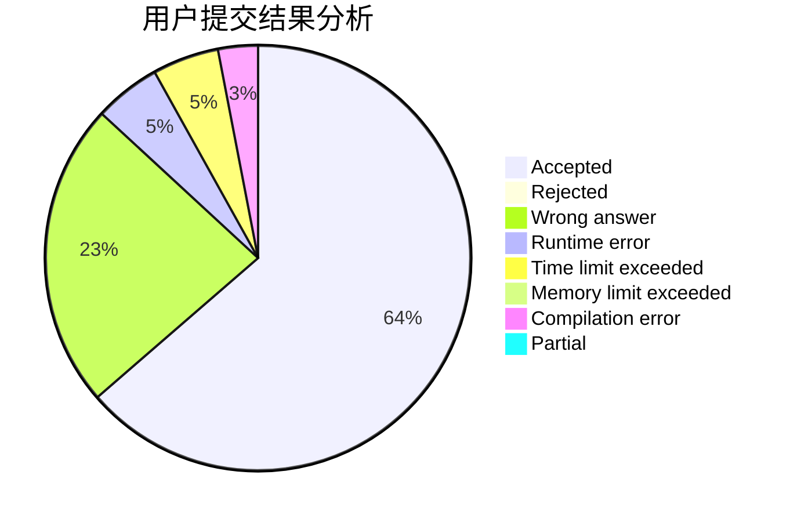
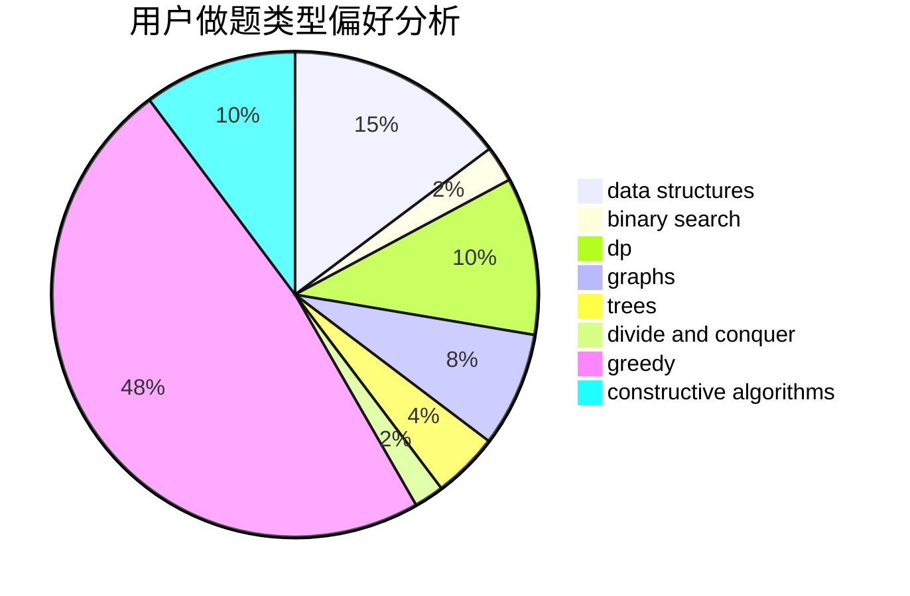
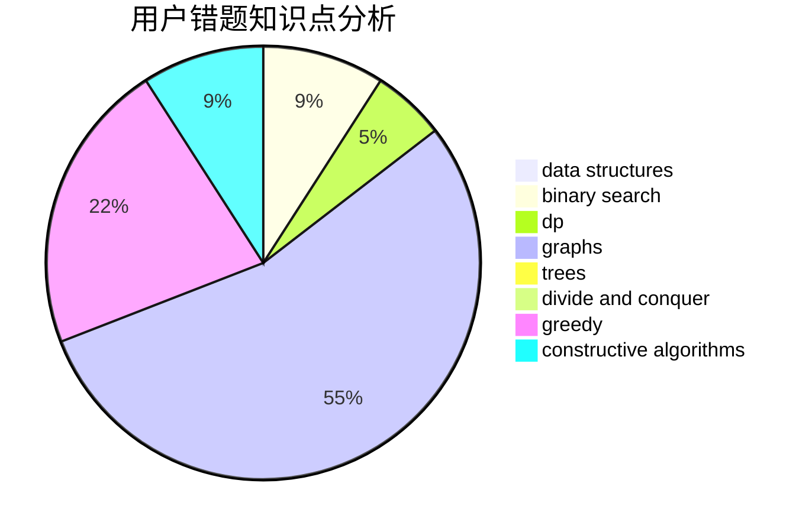

# ljyfan

<!-- tabs:start -->

#### **用户提交结果分析**

#### **用户做题类型偏好分析**

#### **用户错题知识点分析**

<!-- tabs:end -->
# 推荐题目
[699A](https://codeforces.com/contest/699/problem/A)		implementation		  
[318C](https://codeforces.com/contest/318/problem/C)		dsu,graphs,sortings,trees		  
[940A](https://codeforces.com/contest/940/problem/A)		brute force,
                        greedy,
                        sortings		  
[1013E](https://codeforces.com/contest/1013/problem/E)		dsu,graphs,sortings,trees		  
[1245C](https://codeforces.com/contest/1245/problem/C)		dp		  
[1341B](https://codeforces.com/contest/1341/problem/B)		greedy,
                        implementation		  
[1145C](https://codeforces.com/contest/1145/problem/C)		bitmasks,
                        brute force		  
[624A](https://codeforces.com/contest/624/problem/A)		math		  
[114E](https://codeforces.com/contest/114/problem/E)		dsu,graphs,sortings,trees		  
[924A](https://codeforces.com/contest/924/problem/A)		greedy,
                        implementation		  
