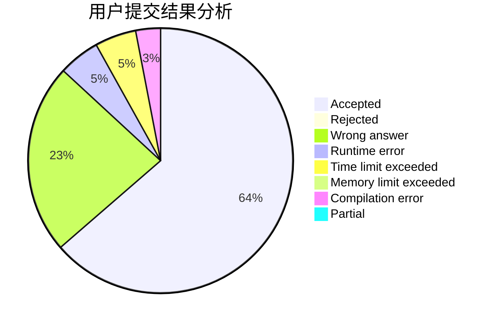
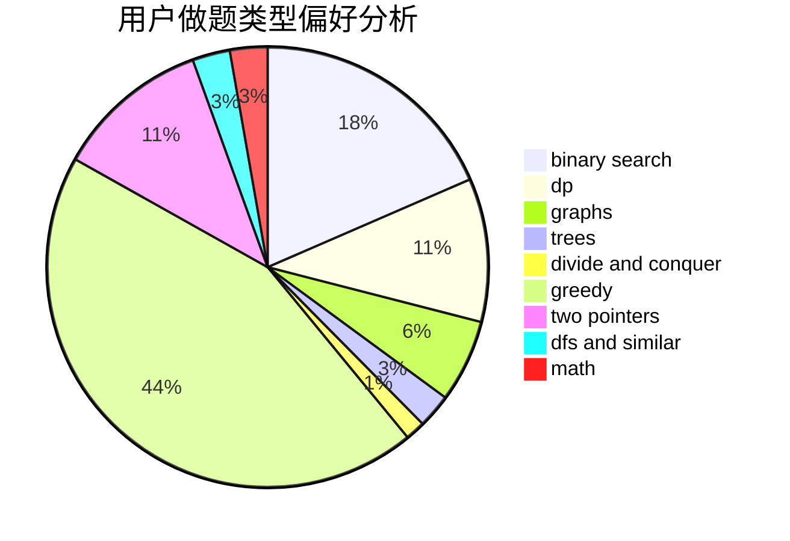

# ljyfan

<!-- tabs:start -->

#### **用户提交结果分析**

#### **用户做题类型偏好分析**

<!-- tabs:end -->
# 推荐题目
[699A](https://codeforces.com/contest/699/problem/A)
[318C](https://codeforces.com/contest/318/problem/C)
[940A](https://codeforces.com/contest/940/problem/A)
[1013E](https://codeforces.com/contest/1013/problem/E)
[1245C](https://codeforces.com/contest/1245/problem/C)
[1341B](https://codeforces.com/contest/1341/problem/B)
[1145C](https://codeforces.com/contest/1145/problem/C)
[624A](https://codeforces.com/contest/624/problem/A)
[114E](https://codeforces.com/contest/114/problem/E)
[924A](https://codeforces.com/contest/924/problem/A)
