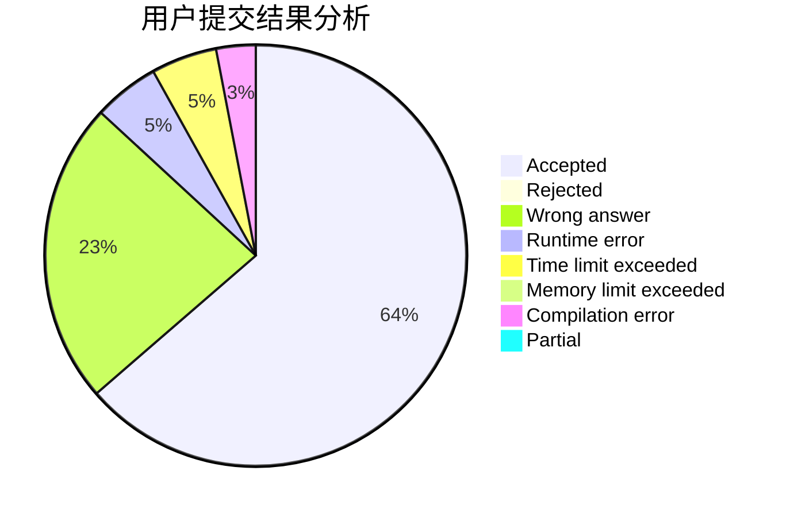
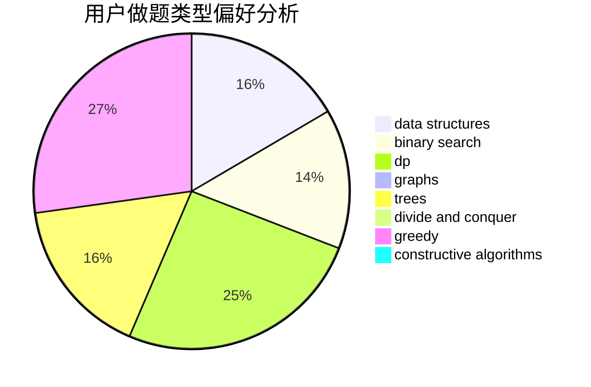
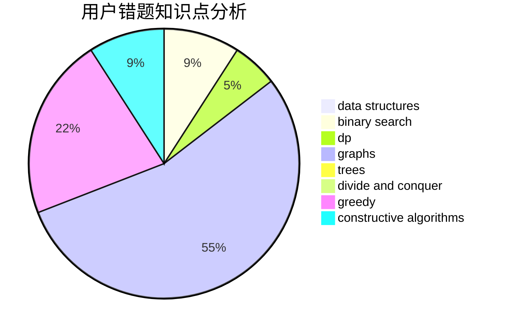

# ljyfan

<!-- tabs:start -->

#### **用户提交结果分析**

#### **用户做题类型偏好分析**

#### **用户错题知识点分析**

<!-- tabs:end -->
# 推荐题目
[673B](https://codeforces.com/contest/673/problem/B)		greedy,
                        implementation		  
[300A](https://codeforces.com/contest/300/problem/A)		brute force,
                        constructive algorithms,
                        implementation		  
[920A](https://codeforces.com/contest/920/problem/A)		implementation		  
[1013B](https://codeforces.com/contest/1013/problem/B)		greedy		  
[123E](https://codeforces.com/contest/123/problem/E)		dfs and similar,
                        dp,
                        probabilities,
                        trees		  
[1334C](https://codeforces.com/contest/1334/problem/C)		brute force,
                        constructive algorithms,
                        greedy,
                        math		  
[1143C](https://codeforces.com/contest/1143/problem/C)		dfs and similar,
                        trees		  
[606A](https://codeforces.com/contest/606/problem/A)		implementation		  
[1148E](https://codeforces.com/contest/1148/problem/E)		constructive algorithms,
                        greedy,
                        math,
                        sortings,
                        two pointers		  
[909C](https://codeforces.com/contest/909/problem/C)		dp		  
