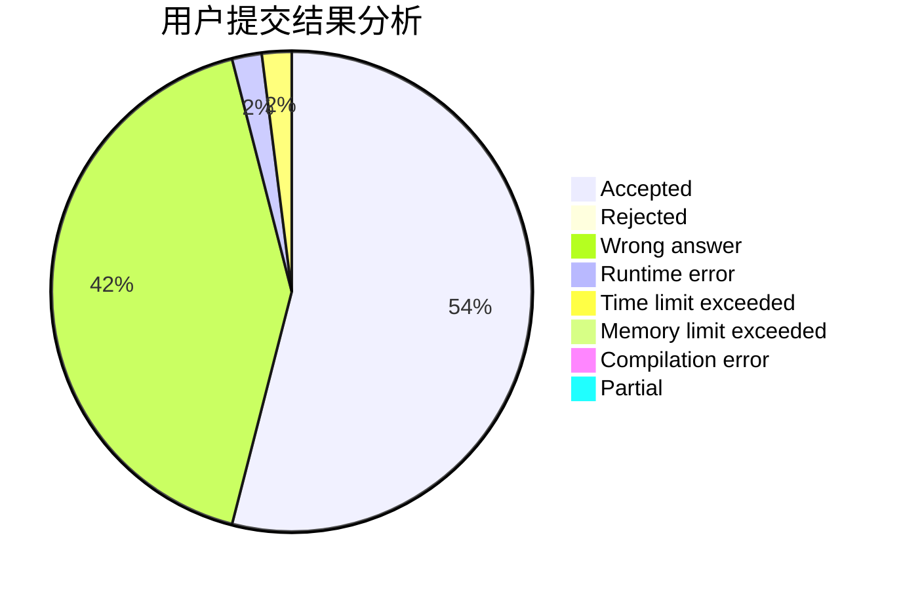
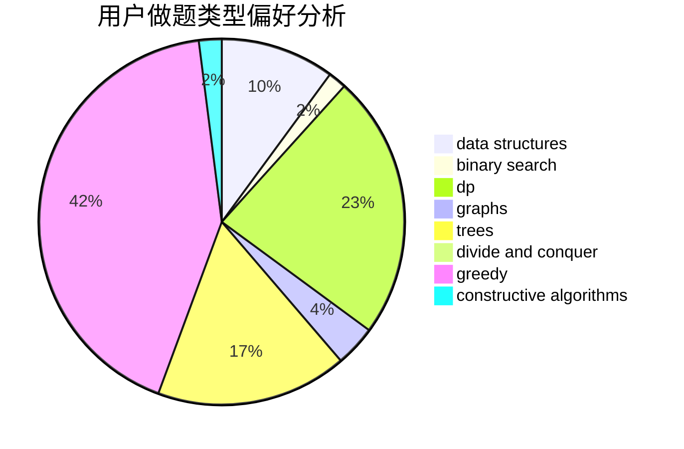

# lkClare

<!-- tabs:start -->

#### **用户提交结果分析**

#### **用户做题类型偏好分析**

#### **用户错题知识点分析**

<!-- tabs:end -->
# 推荐题目
[608D](https://codeforces.com/contest/608/problem/D)		dsu,graphs,sortings,trees		  
[558D](https://codeforces.com/contest/558/problem/D)		data structures,
                        implementation,
                        sortings		  
[1473E](https://codeforces.com/contest/1473/problem/E)		graphs,
                        shortest paths		  
[1379E](https://codeforces.com/contest/1379/problem/E)		constructive algorithms,
                        divide and conquer,
                        dp,
                        math,
                        trees		  
[354D](https://codeforces.com/contest/354/problem/D)		dp		  
[1183A](https://codeforces.com/contest/1183/problem/A)		implementation		  
[797D](https://codeforces.com/contest/797/problem/D)		data structures,
                        dfs and similar		  
[277D](https://codeforces.com/contest/277/problem/D)		dp,
                        probabilities		  
[97A](https://codeforces.com/contest/97/problem/A)		brute force,
                        implementation		  
[1040B](https://codeforces.com/contest/1040/problem/B)		dp,
                        greedy,
                        math		  
