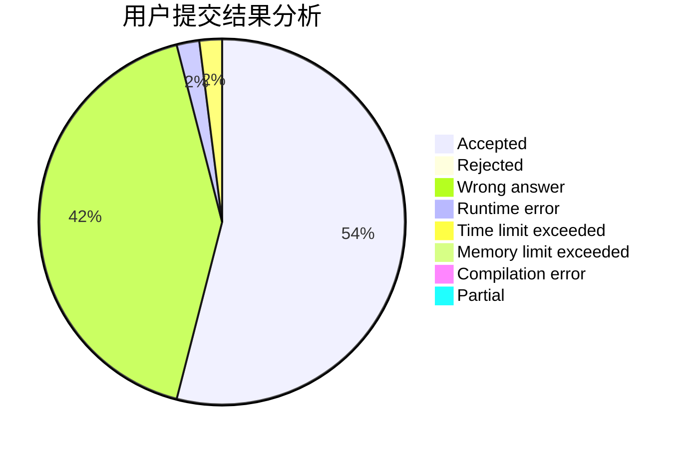
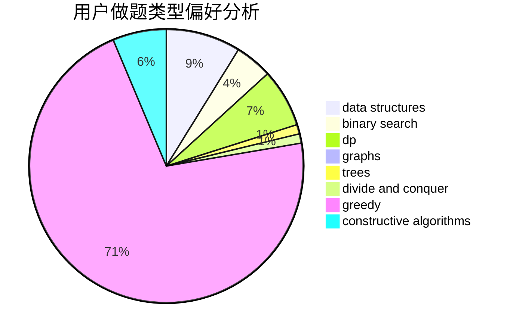

# lkClare

<!-- tabs:start -->

#### **用户提交结果分析**

#### **用户做题类型偏好分析**

#### **用户错题知识点分析**

<!-- tabs:end -->
# 推荐题目
[627E](https://codeforces.com/contest/627/problem/E)		two pointers		  
[581B](https://codeforces.com/contest/581/problem/B)		implementation,
                        math		  
[1482B](https://codeforces.com/contest/1482/problem/B)		implementation,
                        math		  
[1388E](https://codeforces.com/contest/1388/problem/E)		data structures,
                        geometry,
                        sortings		  
[380C](https://codeforces.com/contest/380/problem/C)		data structures,
                        schedules		  
[1185D](https://codeforces.com/contest/1185/problem/D)		implementation,
                        math		  
[811C](https://codeforces.com/contest/811/problem/C)		dp,
                        implementation		  
[292E](https://codeforces.com/contest/292/problem/E)		data structures		  
[994A](https://codeforces.com/contest/994/problem/A)		implementation		  
[1041B](https://codeforces.com/contest/1041/problem/B)		math		  
