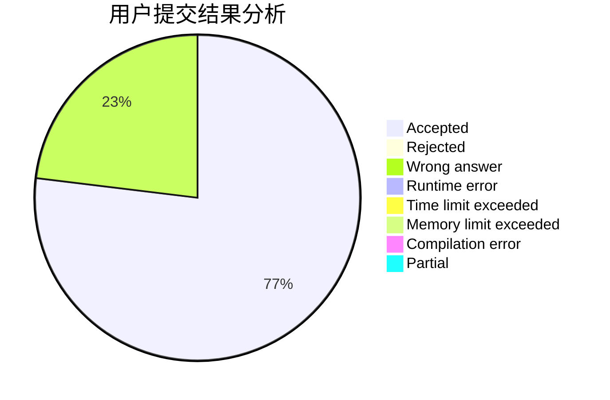
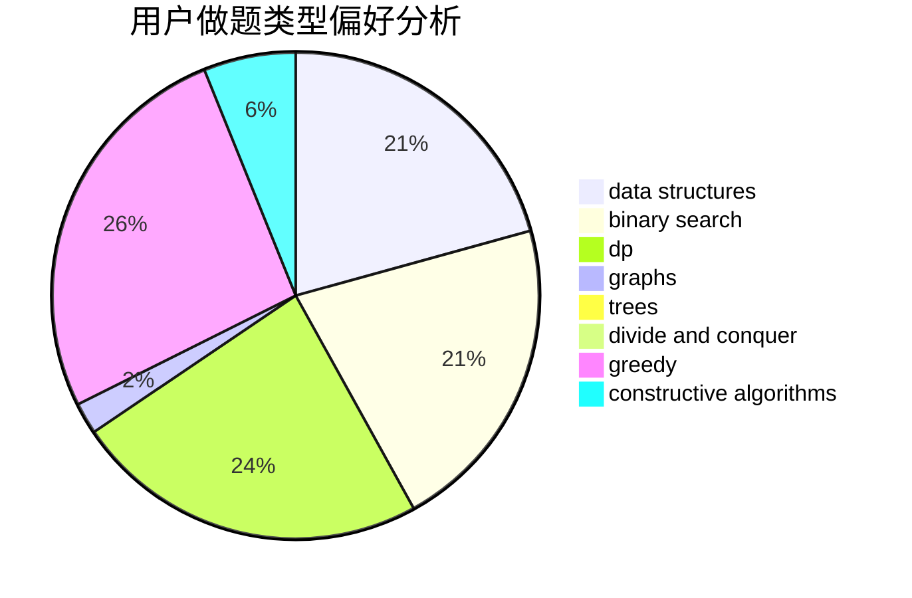
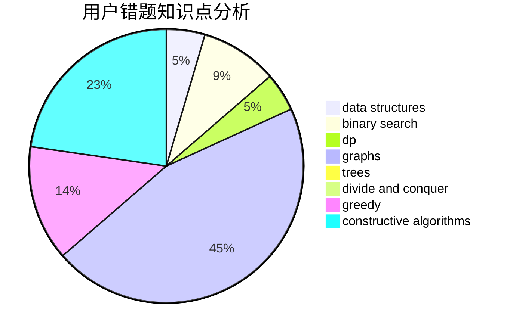

# BilyHurington3

<!-- tabs:start -->

#### **用户提交结果分析**

#### **用户做题类型偏好分析**

#### **用户错题知识点分析**

<!-- tabs:end -->
# 推荐题目
[542E](https://codeforces.com/contest/542/problem/E)		graphs,
                        shortest paths		  
[542F](https://codeforces.com/contest/542/problem/F)		dp,
                        greedy		  
[317C](https://codeforces.com/contest/317/problem/C)		constructive algorithms,
                        dfs and similar,
                        graphs,
                        trees		  
[430B](https://codeforces.com/contest/430/problem/B)		brute force,
                        two pointers		  
[540B](https://codeforces.com/contest/540/problem/B)		greedy,
                        implementation		  
[1413F](https://codeforces.com/contest/1413/problem/F)		data structures,
                        trees		  
[165C](https://codeforces.com/contest/165/problem/C)		binary search,
                        brute force,
                        dp,
                        math,
                        strings,
                        two pointers		  
[1346E](https://codeforces.com/contest/1346/problem/E)		*special problem,
                        dp,
                        graphs		  
[291A](https://codeforces.com/contest/291/problem/A)		*special problem,
                        implementation,
                        sortings		  
[452C](https://codeforces.com/contest/452/problem/C)		combinatorics,
                        math,
                        probabilities		  
