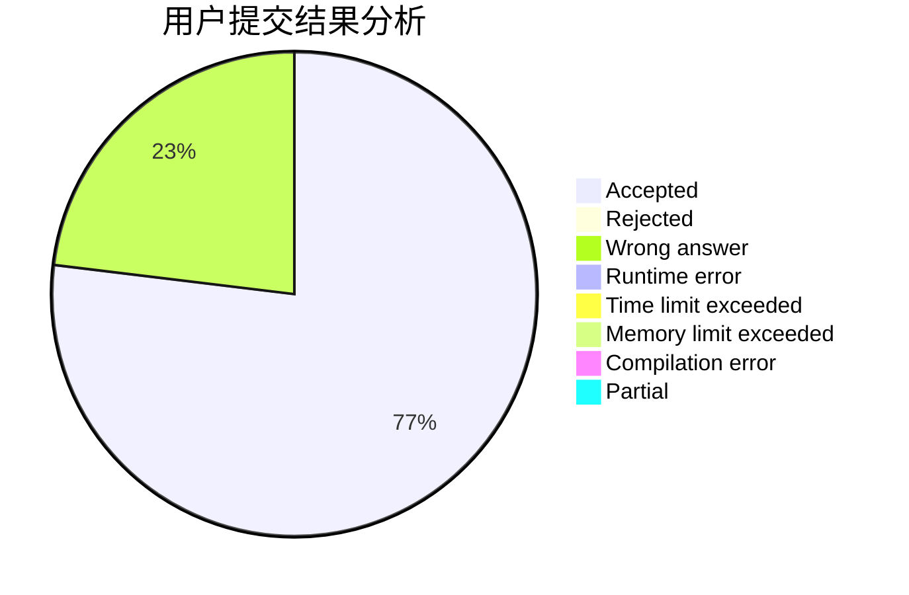
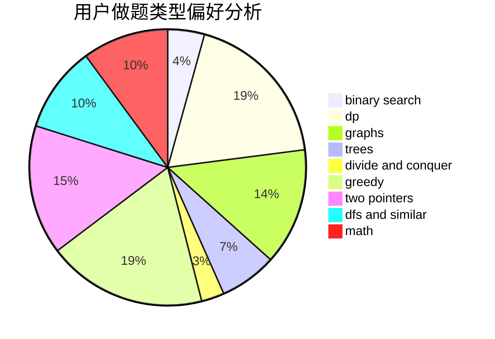

# BilyHurington3

<!-- tabs:start -->

#### **用户提交结果分析**

#### **用户做题类型偏好分析**

<!-- tabs:end -->
# 推荐题目
[567A](https://codeforces.com/contest/567/problem/A)
[567B](https://codeforces.com/contest/567/problem/B)
[346E](https://codeforces.com/contest/346/problem/E)
[452C](https://codeforces.com/contest/452/problem/C)
[566C](https://codeforces.com/contest/566/problem/C)
[1423C](https://codeforces.com/contest/1423/problem/C)
[18E](https://codeforces.com/contest/18/problem/E)
[1353F](https://codeforces.com/contest/1353/problem/F)
[305D](https://codeforces.com/contest/305/problem/D)
[474C](https://codeforces.com/contest/474/problem/C)
