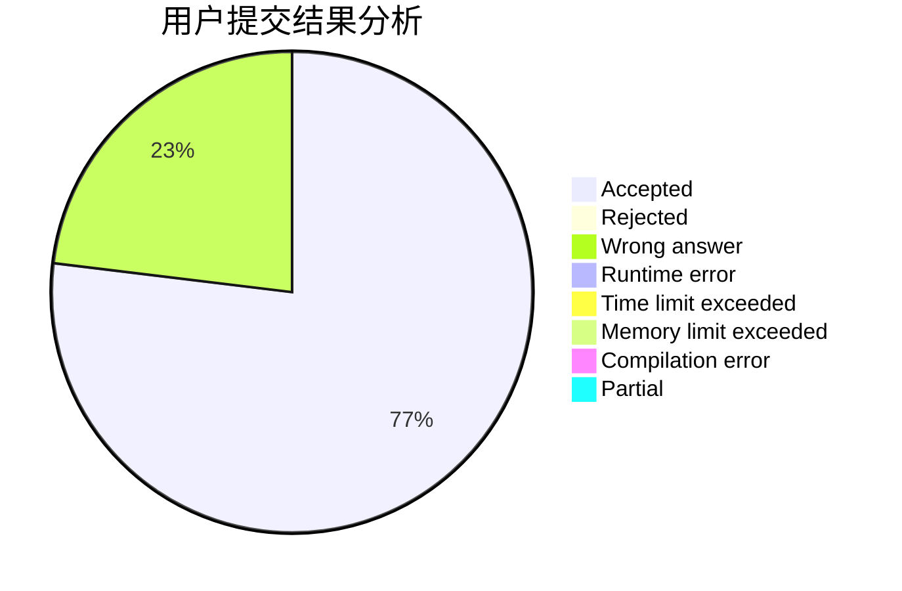
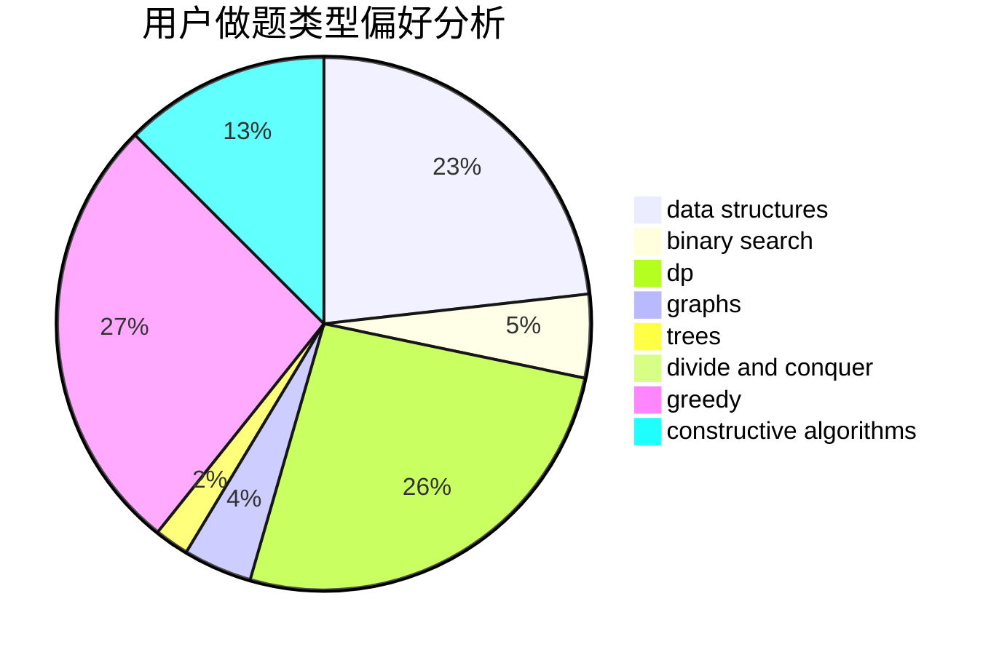
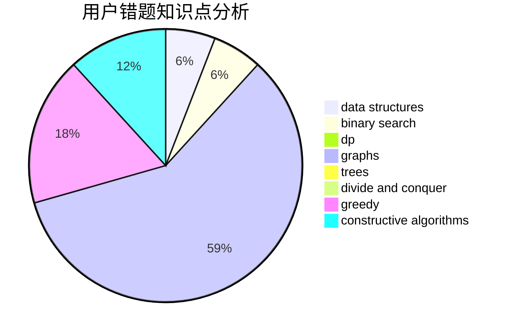

# BilyHurington3

<!-- tabs:start -->

#### **用户提交结果分析**

#### **用户做题类型偏好分析**

#### **用户错题知识点分析**

<!-- tabs:end -->
# 推荐题目
[567A](https://codeforces.com/contest/567/problem/A)		greedy,
                        implementation		  
[567B](https://codeforces.com/contest/567/problem/B)		implementation		  
[346E](https://codeforces.com/contest/346/problem/E)		math,
                        number theory		  
[452C](https://codeforces.com/contest/452/problem/C)		combinatorics,
                        math,
                        probabilities		  
[566C](https://codeforces.com/contest/566/problem/C)		dfs and similar,
                        divide and conquer,
                        trees		  
[1423C](https://codeforces.com/contest/1423/problem/C)		divide and conquer,
                        graphs,
                        trees		  
[18E](https://codeforces.com/contest/18/problem/E)		dp		  
[1353F](https://codeforces.com/contest/1353/problem/F)		brute force,
                        dp		  
[305D](https://codeforces.com/contest/305/problem/D)		combinatorics,
                        math		  
[474C](https://codeforces.com/contest/474/problem/C)		brute force,
                        geometry		  
