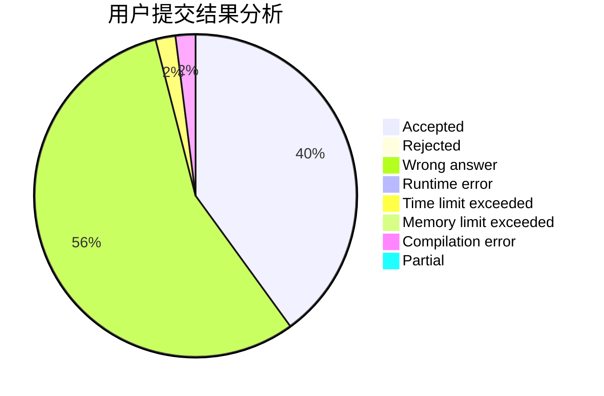
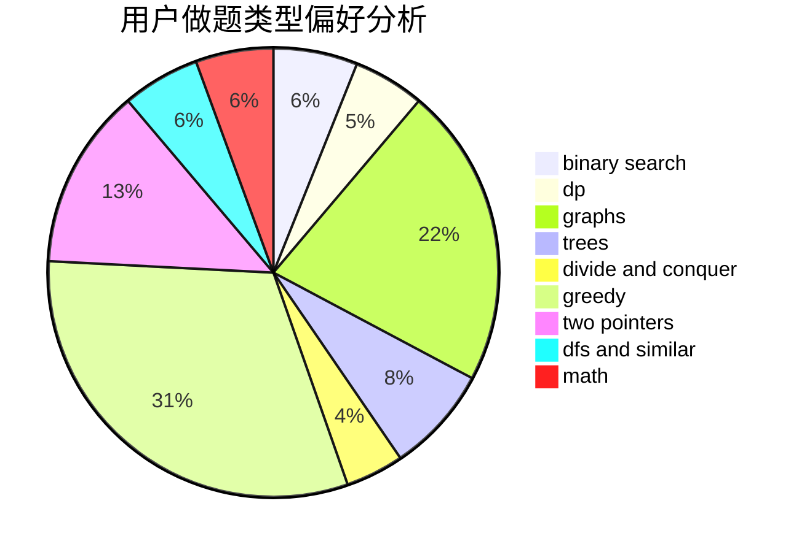

# llbbyy

<!-- tabs:start -->

#### **用户提交结果分析**

#### **用户做题类型偏好分析**

<!-- tabs:end -->
# 推荐题目
[14D](https://codeforces.com/contest/14/problem/D)
[429B](https://codeforces.com/contest/429/problem/B)
[1070D](https://codeforces.com/contest/1070/problem/D)
[601D](https://codeforces.com/contest/601/problem/D)
[1041D](https://codeforces.com/contest/1041/problem/D)
[1167E](https://codeforces.com/contest/1167/problem/E)
[30C](https://codeforces.com/contest/30/problem/C)
[159D](https://codeforces.com/contest/159/problem/D)
[627F](https://codeforces.com/contest/627/problem/F)
[873A](https://codeforces.com/contest/873/problem/A)
