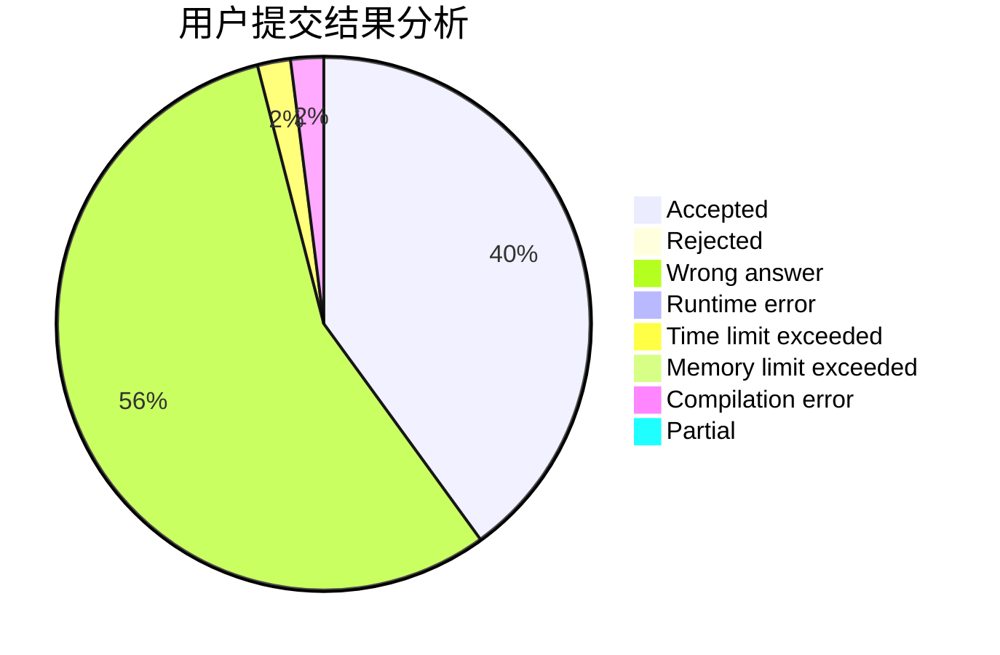
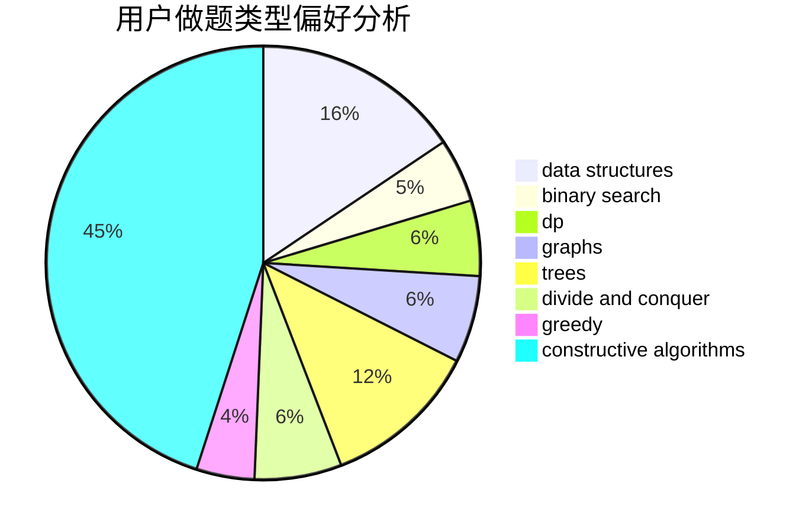
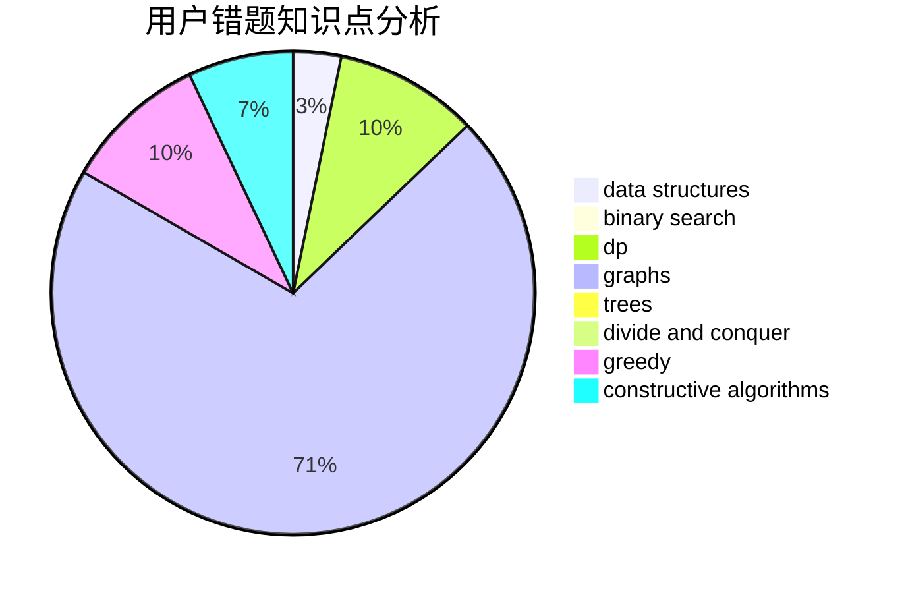

# llbbyy

<!-- tabs:start -->

#### **用户提交结果分析**

#### **用户做题类型偏好分析**

#### **用户错题知识点分析**

<!-- tabs:end -->
# 推荐题目
[14D](https://codeforces.com/contest/14/problem/D)		dfs and similar,
                        dp,
                        graphs,
                        shortest paths,
                        trees,
                        two pointers		  
[429B](https://codeforces.com/contest/429/problem/B)		dp		  
[1070D](https://codeforces.com/contest/1070/problem/D)		greedy		  
[601D](https://codeforces.com/contest/601/problem/D)		data structures,
                        dfs and similar,
                        dsu,
                        hashing,
                        strings,
                        trees		  
[1041D](https://codeforces.com/contest/1041/problem/D)		binary search,
                        data structures,
                        two pointers		  
[1167E](https://codeforces.com/contest/1167/problem/E)		binary search,
                        combinatorics,
                        data structures,
                        two pointers		  
[30C](https://codeforces.com/contest/30/problem/C)		dp,
                        probabilities		  
[159D](https://codeforces.com/contest/159/problem/D)		*special problem,
                        brute force,
                        dp,
                        strings		  
[627F](https://codeforces.com/contest/627/problem/F)		dfs and similar,
                        dsu,
                        graphs,
                        trees		  
[873A](https://codeforces.com/contest/873/problem/A)		implementation		  
