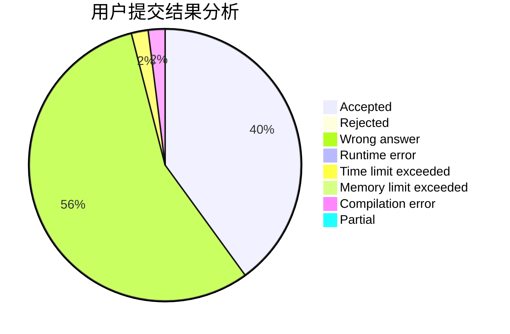
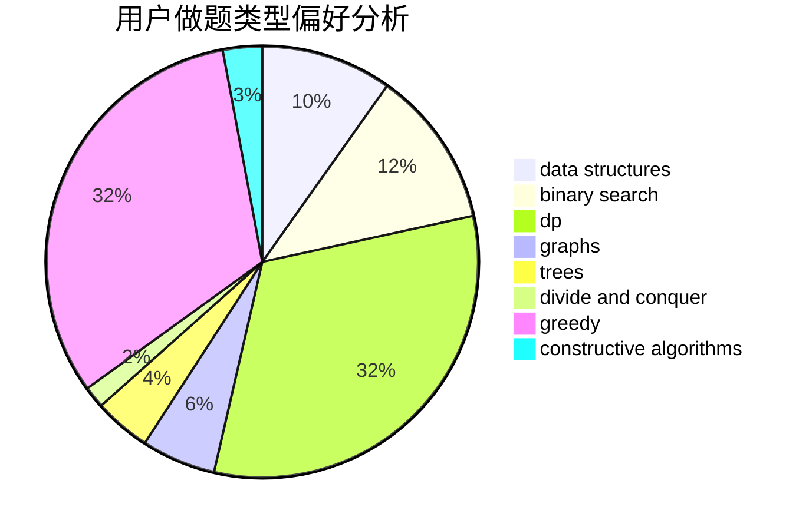
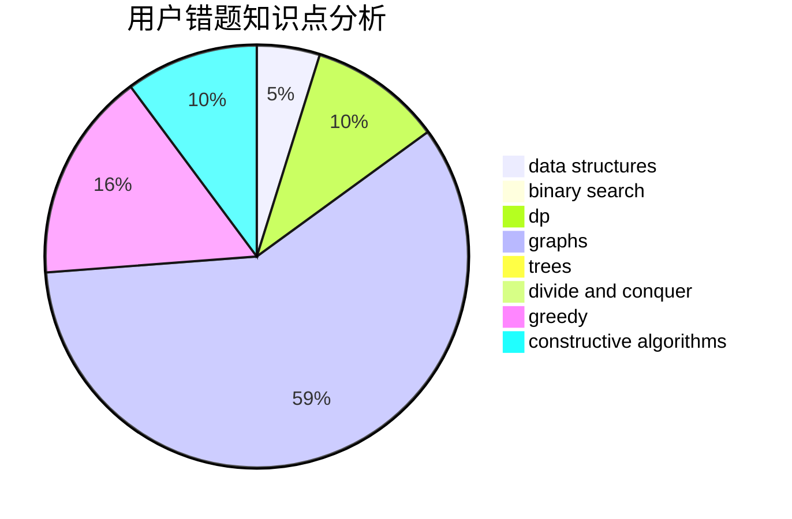

# llbbyy

<!-- tabs:start -->

#### **用户提交结果分析**

#### **用户做题类型偏好分析**

#### **用户错题知识点分析**

<!-- tabs:end -->
# 推荐题目
[1491G](https://codeforces.com/contest/1491/problem/G)		constructive algorithms,
                        graphs,
                        math		  
[3A](https://codeforces.com/contest/3/problem/A)		greedy,
                        shortest paths		  
[1070A](https://codeforces.com/contest/1070/problem/A)		dp,
                        graphs,
                        number theory,
                        shortest paths		  
[581C](https://codeforces.com/contest/581/problem/C)		implementation,
                        math,
                        sortings		  
[1041A](https://codeforces.com/contest/1041/problem/A)		greedy,
                        implementation,
                        sortings		  
[1165C](https://codeforces.com/contest/1165/problem/C)		greedy		  
[294B](https://codeforces.com/contest/294/problem/B)		dp,
                        greedy		  
[1508B](https://codeforces.com/contest/1508/problem/B)		binary search,
                        bitmasks,
                        combinatorics,
                        constructive algorithms,
                        implementation,
                        math		  
[609A](https://codeforces.com/contest/609/problem/A)		greedy,
                        implementation,
                        sortings		  
[854C](https://codeforces.com/contest/854/problem/C)		dsu,graphs,sortings,trees		  
