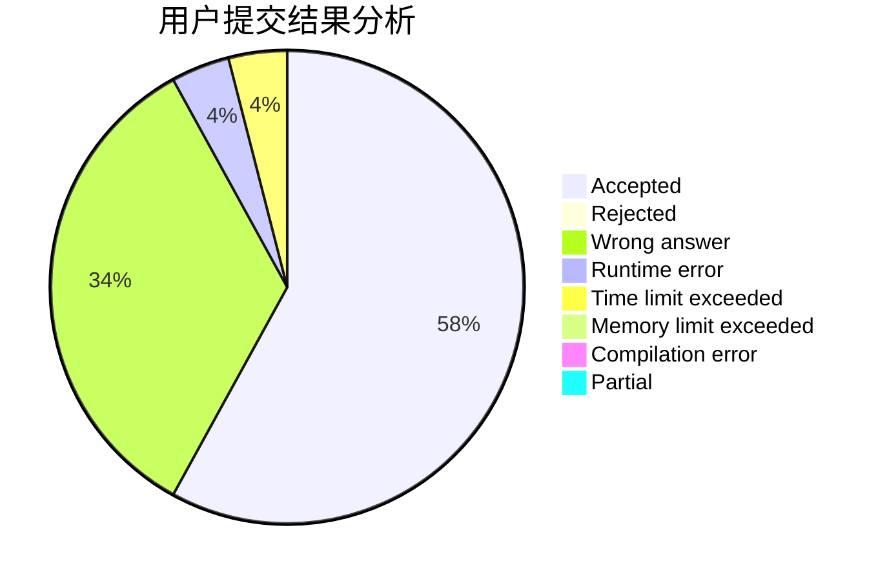
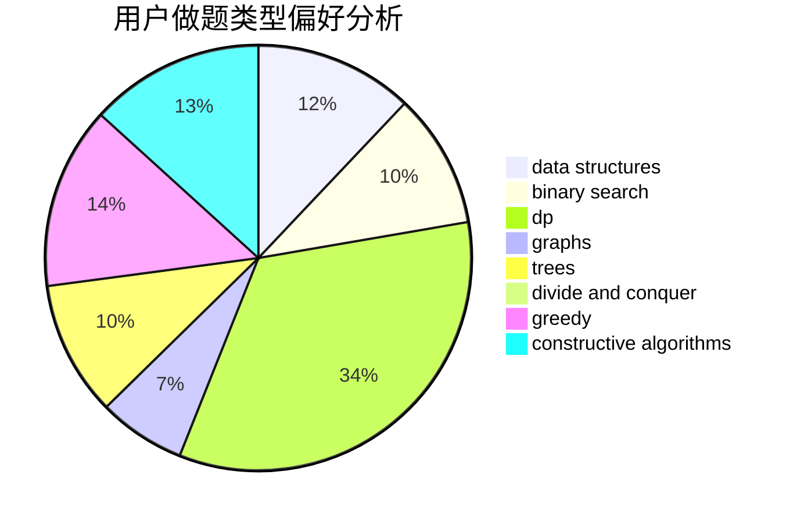
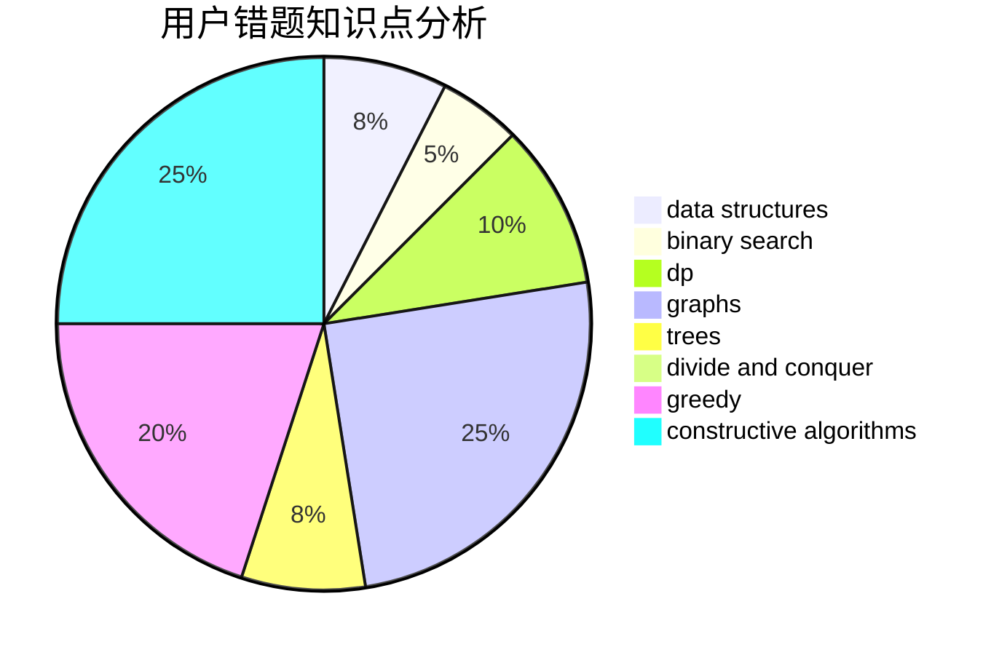

# lmatt

<!-- tabs:start -->

#### **用户提交结果分析**

#### **用户做题类型偏好分析**

#### **用户错题知识点分析**

<!-- tabs:end -->
# 推荐题目
[1322D](https://codeforces.com/contest/1322/problem/D)		bitmasks,
                        dp		  
[1283A](https://codeforces.com/contest/1283/problem/A)		math		  
[1388B](https://codeforces.com/contest/1388/problem/B)		greedy,
                        math		  
[667B](https://codeforces.com/contest/667/problem/B)		constructive algorithms,
                        geometry		  
[1020E](https://codeforces.com/contest/1020/problem/E)		dsu,graphs,sortings,trees		  
[171E](https://codeforces.com/contest/171/problem/E)		*special problem		  
[934E](https://codeforces.com/contest/934/problem/E)		dsu,graphs,sortings,trees		  
[282E](https://codeforces.com/contest/282/problem/E)		bitmasks,
                        data structures,
                        trees		  
[1288F](https://codeforces.com/contest/1288/problem/F)		constructive algorithms,
                        flows		  
[623C](https://codeforces.com/contest/623/problem/C)		binary search,
                        dp		  
