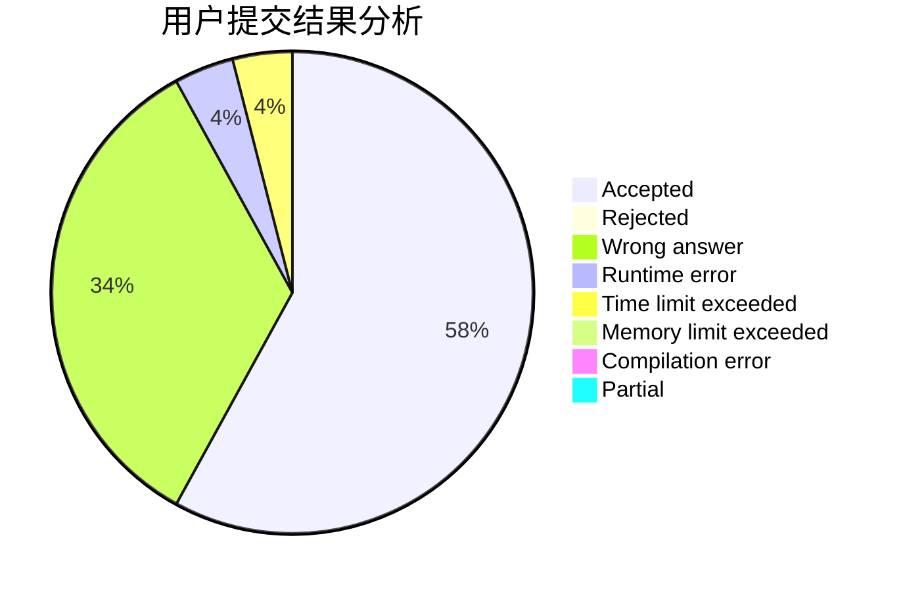
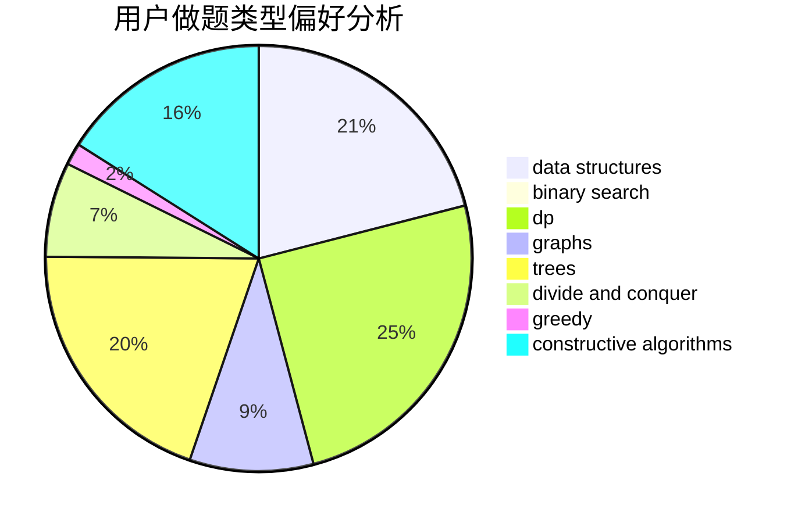
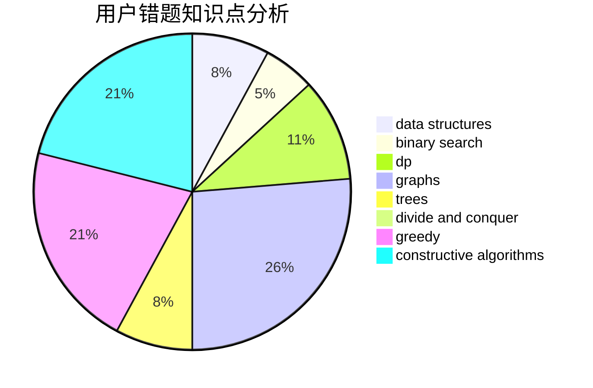

# lmatt

<!-- tabs:start -->

#### **用户提交结果分析**

#### **用户做题类型偏好分析**

#### **用户错题知识点分析**

<!-- tabs:end -->
# 推荐题目
[1329C](https://codeforces.com/contest/1329/problem/C)		constructive algorithms,
                        data structures,
                        greedy,
                        implementation		  
[1290A](https://codeforces.com/contest/1290/problem/A)		brute force,
                        data structures,
                        implementation		  
[1397E](https://codeforces.com/contest/1397/problem/E)		dsu,graphs,sortings,trees		  
[689B](https://codeforces.com/contest/689/problem/B)		dfs and similar,
                        graphs,
                        greedy,
                        shortest paths		  
[1023C](https://codeforces.com/contest/1023/problem/C)		greedy		  
[199B](https://codeforces.com/contest/199/problem/B)		geometry		  
[956D](https://codeforces.com/contest/956/problem/D)		dsu,graphs,sortings,trees		  
[299C](https://codeforces.com/contest/299/problem/C)		dsu,graphs,sortings,trees		  
[12962](https://codeforces.com/contest/1296/problem/2)		dsu,graphs,sortings,trees		  
[651C](https://codeforces.com/contest/651/problem/C)		dsu,graphs,sortings,trees		  
