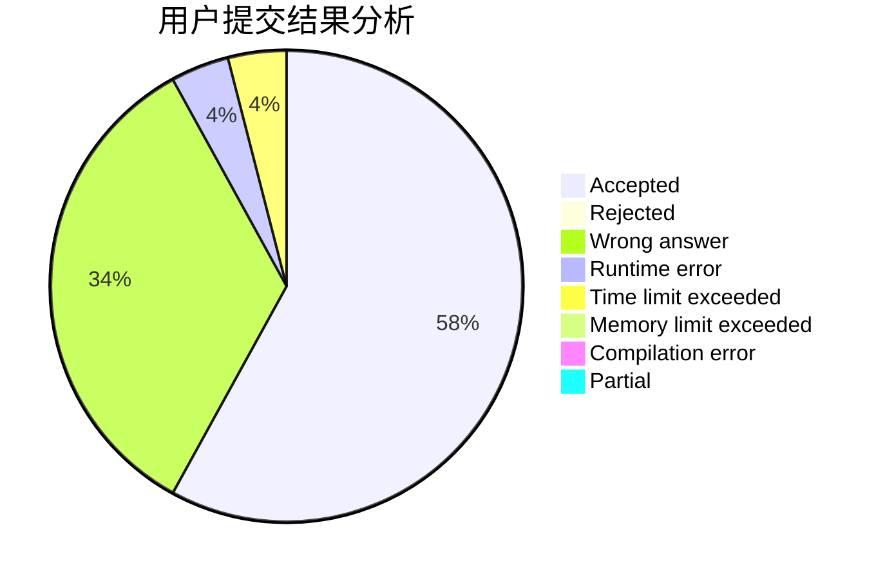
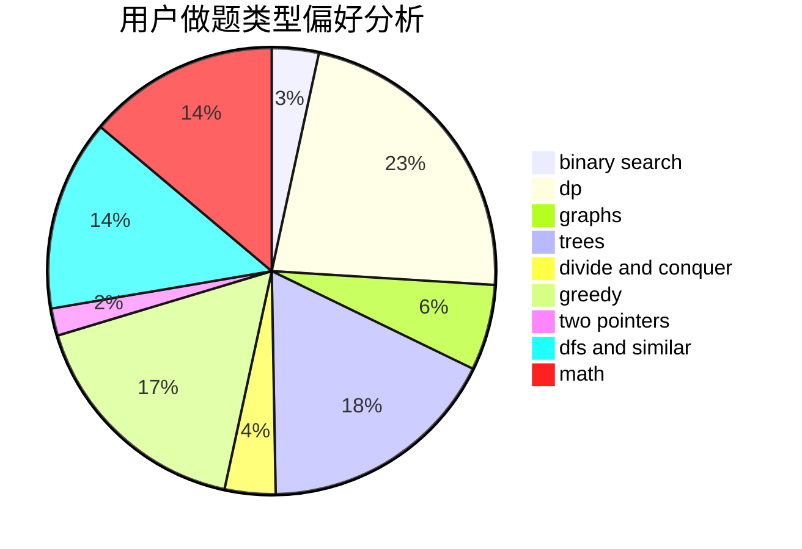

# lmatt

<!-- tabs:start -->

#### **用户提交结果分析**

#### **用户做题类型偏好分析**

<!-- tabs:end -->
# 推荐题目
[1329C](https://codeforces.com/contest/1329/problem/C)
[1290A](https://codeforces.com/contest/1290/problem/A)
[1397E](https://codeforces.com/contest/1397/problem/E)
[689B](https://codeforces.com/contest/689/problem/B)
[1023C](https://codeforces.com/contest/1023/problem/C)
[199B](https://codeforces.com/contest/199/problem/B)
[956D](https://codeforces.com/contest/956/problem/D)
[299C](https://codeforces.com/contest/299/problem/C)
[12962](https://codeforces.com/contest/1296/problem/2)
[651C](https://codeforces.com/contest/651/problem/C)
