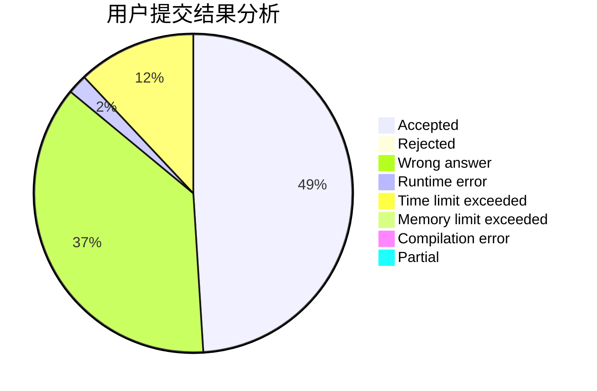
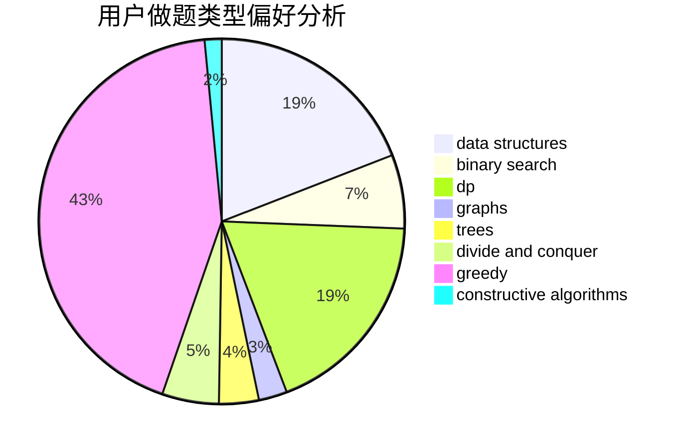

# lmsh

<!-- tabs:start -->

#### **用户提交结果分析**

#### **用户做题类型偏好分析**

#### **用户错题知识点分析**

<!-- tabs:end -->
# 推荐题目
[28C](https://codeforces.com/contest/28/problem/C)		combinatorics,
                        dp,
                        probabilities		  
[171B](https://codeforces.com/contest/171/problem/B)		*special problem,
                        combinatorics		  
[1015C](https://codeforces.com/contest/1015/problem/C)		sortings		  
[597C](https://codeforces.com/contest/597/problem/C)		data structures,
                        dp		  
[585B](https://codeforces.com/contest/585/problem/B)		dfs and similar,
                        graphs,
                        shortest paths		  
[1310D](https://codeforces.com/contest/1310/problem/D)		dp,
                        graphs,
                        probabilities		  
[189E](https://codeforces.com/contest/189/problem/E)		dsu,graphs,sortings,trees		  
[616D](https://codeforces.com/contest/616/problem/D)		binary search,
                        data structures,
                        two pointers		  
[241E](https://codeforces.com/contest/241/problem/E)		graphs,
                        shortest paths		  
[916D](https://codeforces.com/contest/916/problem/D)		data structures,
                        interactive,
                        trees		  
