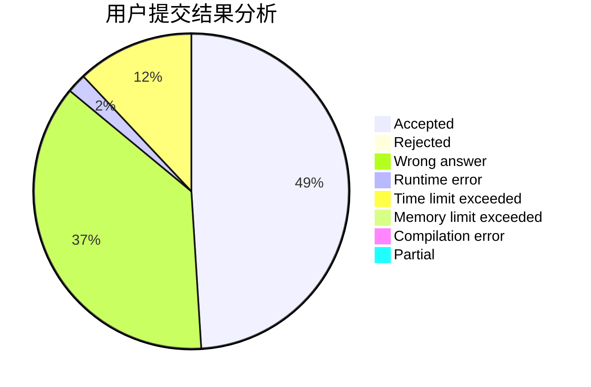
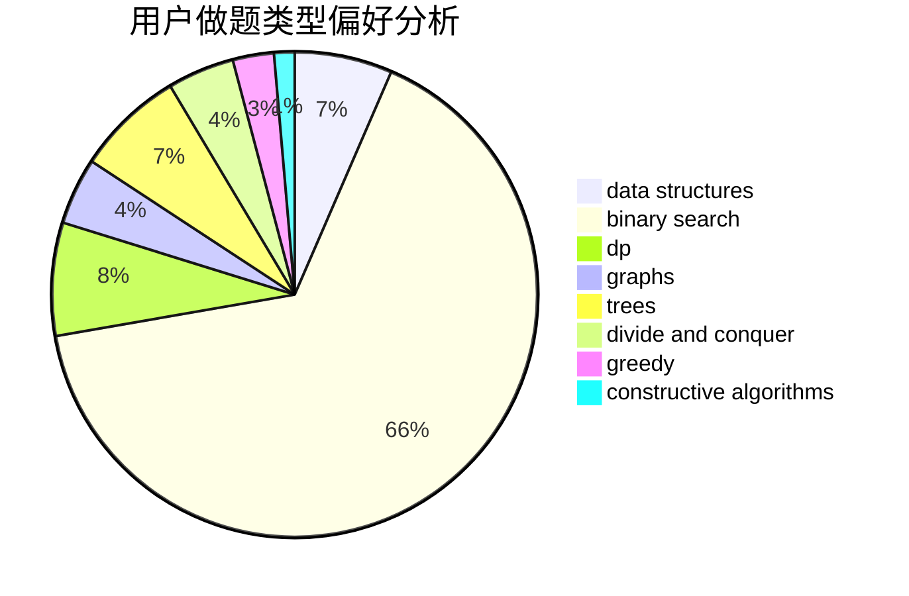

# lmsh

<!-- tabs:start -->

#### **用户提交结果分析**

#### **用户做题类型偏好分析**

#### **用户错题知识点分析**

<!-- tabs:end -->
# 推荐题目
[304C](https://codeforces.com/contest/304/problem/C)		dsu,graphs,sortings,trees		  
[198B](https://codeforces.com/contest/198/problem/B)		shortest paths		  
[1015D](https://codeforces.com/contest/1015/problem/D)		constructive algorithms,
                        greedy		  
[614D](https://codeforces.com/contest/614/problem/D)		dsu,graphs,sortings,trees		  
[605C](https://codeforces.com/contest/605/problem/C)		geometry		  
[131A](https://codeforces.com/contest/131/problem/A)		implementation,
                        strings		  
[213E](https://codeforces.com/contest/213/problem/E)		data structures,
                        hashing,
                        strings		  
[634A](https://codeforces.com/contest/634/problem/A)		constructive algorithms,
                        implementation		  
[263C](https://codeforces.com/contest/263/problem/C)		brute force,
                        dfs and similar,
                        implementation		  
[936E](https://codeforces.com/contest/936/problem/E)		data structures,
                        dfs and similar,
                        divide and conquer,
                        dsu,
                        shortest paths,
                        trees		  
