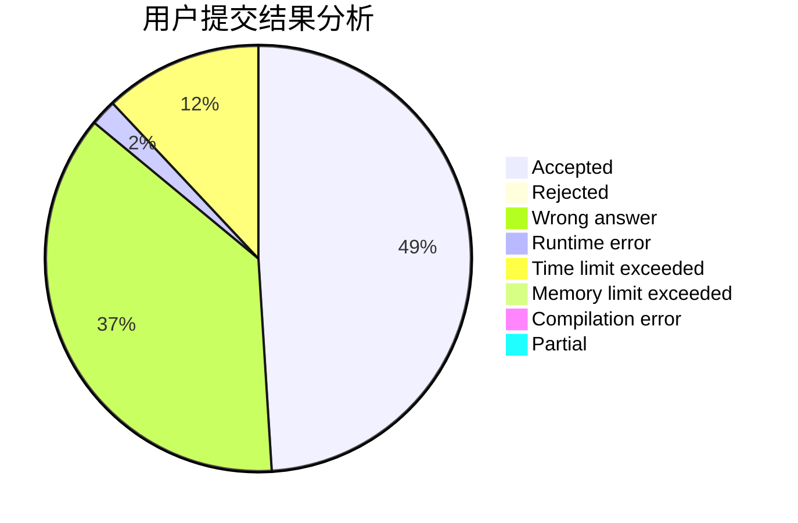
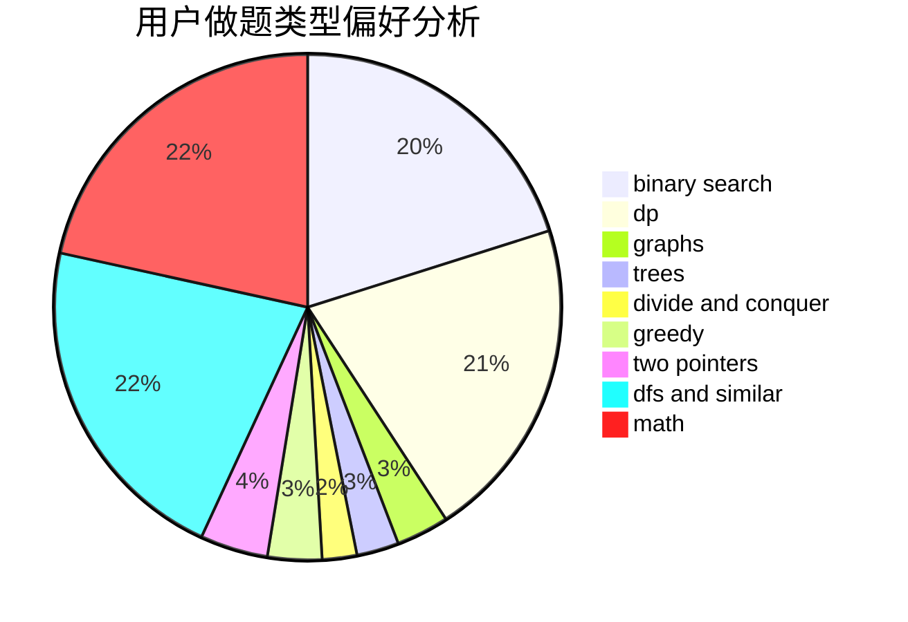

# lmsh

<!-- tabs:start -->

#### **用户提交结果分析**

#### **用户做题类型偏好分析**

<!-- tabs:end -->
# 推荐题目
[304C](https://codeforces.com/contest/304/problem/C)
[198B](https://codeforces.com/contest/198/problem/B)
[1015D](https://codeforces.com/contest/1015/problem/D)
[614D](https://codeforces.com/contest/614/problem/D)
[605C](https://codeforces.com/contest/605/problem/C)
[131A](https://codeforces.com/contest/131/problem/A)
[213E](https://codeforces.com/contest/213/problem/E)
[634A](https://codeforces.com/contest/634/problem/A)
[263C](https://codeforces.com/contest/263/problem/C)
[936E](https://codeforces.com/contest/936/problem/E)
