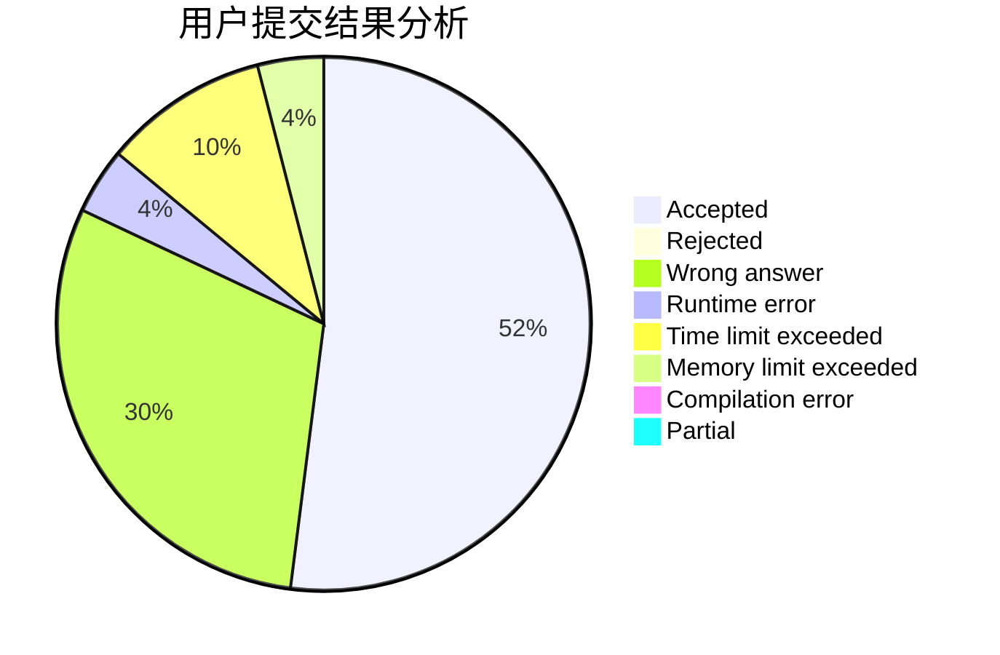
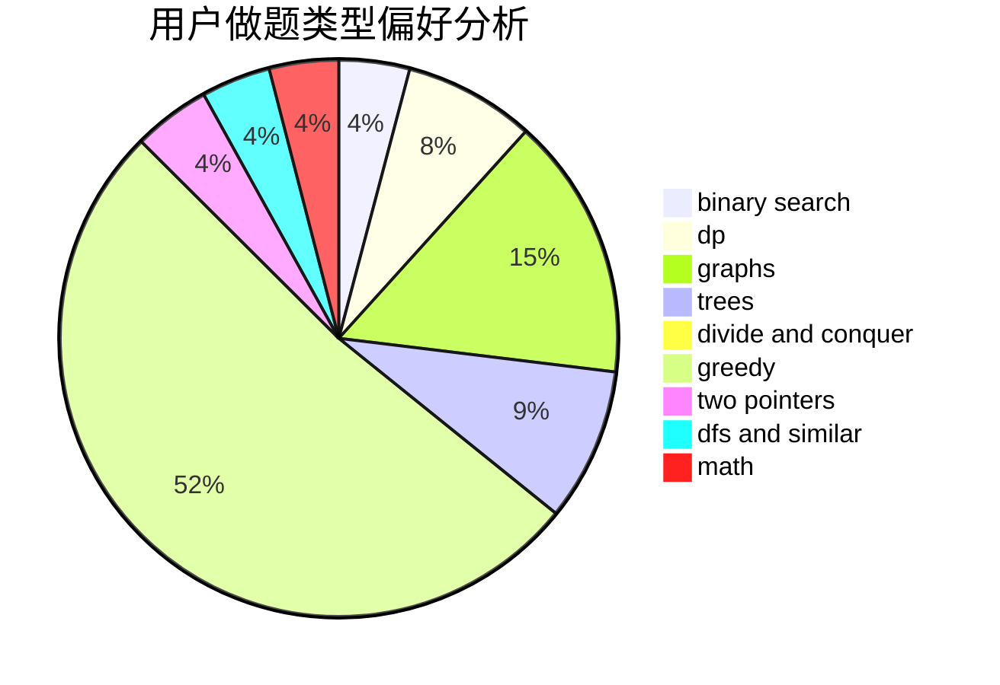

# lndjy

<!-- tabs:start -->

#### **用户提交结果分析**

#### **用户做题类型偏好分析**

<!-- tabs:end -->
# 推荐题目
[1343E](https://codeforces.com/contest/1343/problem/E)
[755D](https://codeforces.com/contest/755/problem/D)
[653D](https://codeforces.com/contest/653/problem/D)
[116A](https://codeforces.com/contest/116/problem/A)
[523A](https://codeforces.com/contest/523/problem/A)
[729C](https://codeforces.com/contest/729/problem/C)
[731B](https://codeforces.com/contest/731/problem/B)
[33C](https://codeforces.com/contest/33/problem/C)
[1076F](https://codeforces.com/contest/1076/problem/F)
[1307A](https://codeforces.com/contest/1307/problem/A)
