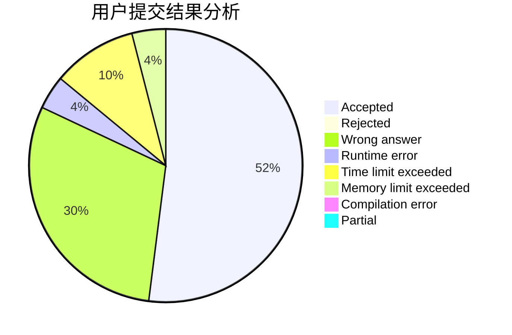
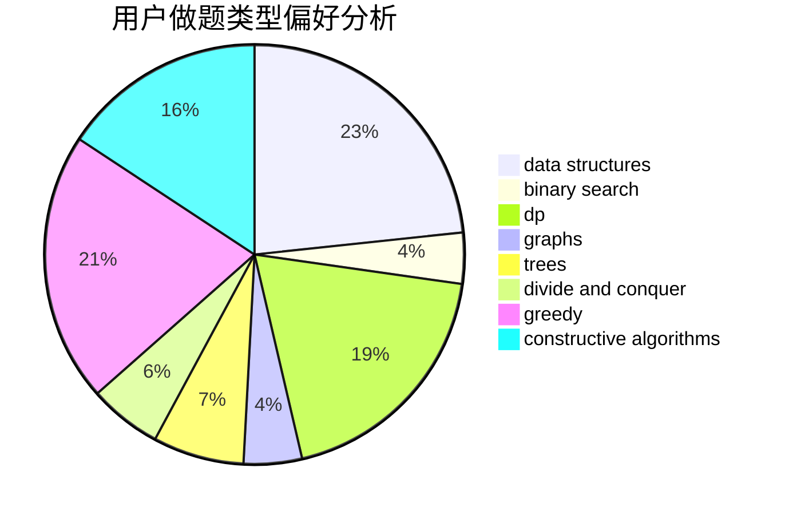
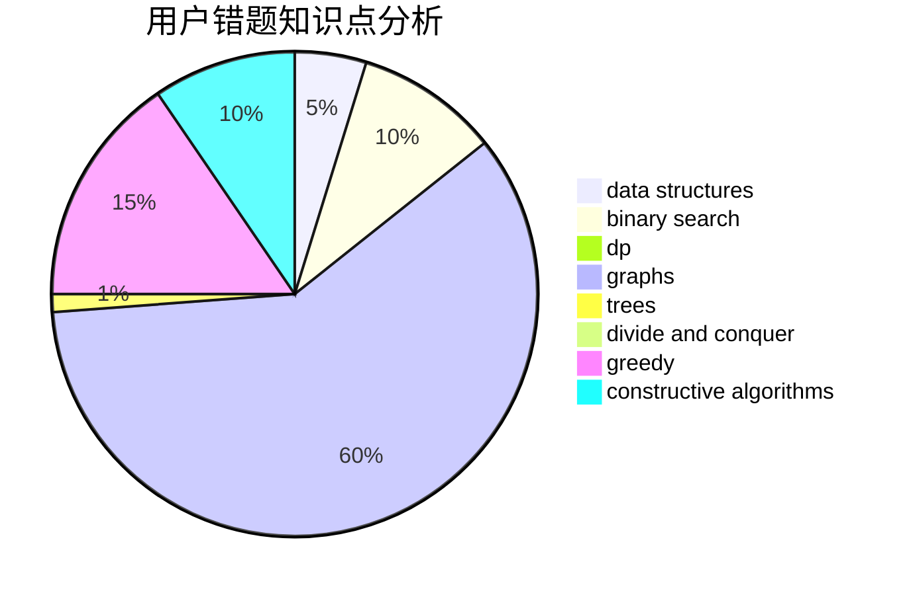

# lndjy

<!-- tabs:start -->

#### **用户提交结果分析**

#### **用户做题类型偏好分析**

#### **用户错题知识点分析**

<!-- tabs:end -->
# 推荐题目
[1336D](https://codeforces.com/contest/1336/problem/D)		constructive algorithms,
                        interactive		  
[734E](https://codeforces.com/contest/734/problem/E)		dfs and similar,
                        dp,
                        trees		  
[627D](https://codeforces.com/contest/627/problem/D)		binary search,
                        dfs and similar,
                        dp,
                        graphs,
                        greedy,
                        trees		  
[1166E](https://codeforces.com/contest/1166/problem/E)		bitmasks,
                        brute force,
                        constructive algorithms,
                        math,
                        number theory		  
[501C](https://codeforces.com/contest/501/problem/C)		constructive algorithms,
                        data structures,
                        greedy,
                        sortings,
                        trees		  
[709B](https://codeforces.com/contest/709/problem/B)		greedy,
                        implementation,
                        sortings		  
[711B](https://codeforces.com/contest/711/problem/B)		constructive algorithms,
                        implementation		  
[316B1](https://codeforces.com/contest/316B/problem/1)		brute force,
                        dfs and similar		  
[1076C](https://codeforces.com/contest/1076/problem/C)		binary search,
                        math		  
[1299E](https://codeforces.com/contest/1299/problem/E)		interactive,
                        math		  
