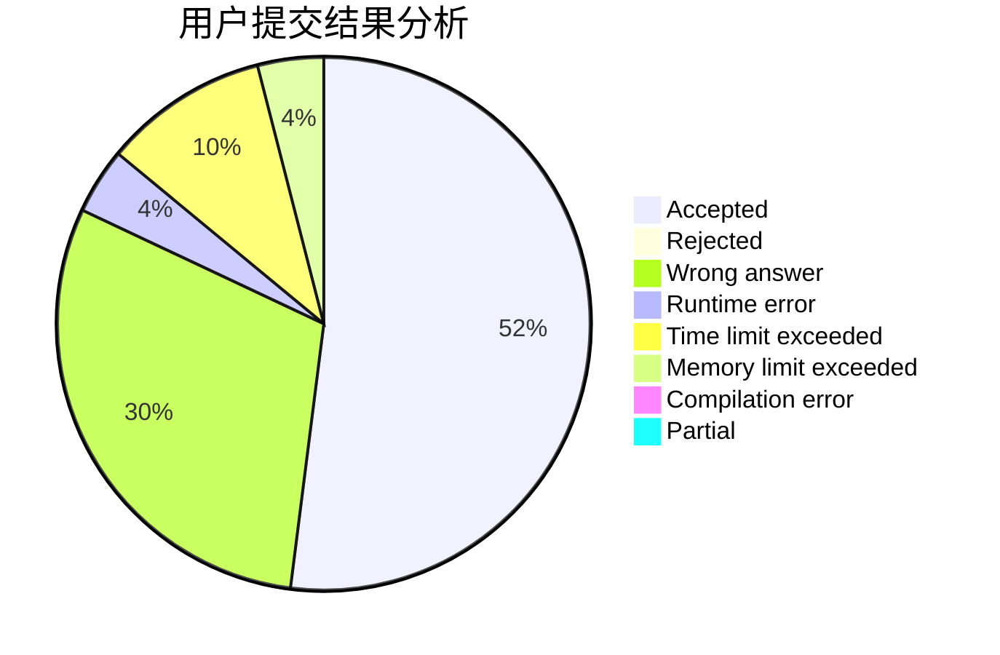
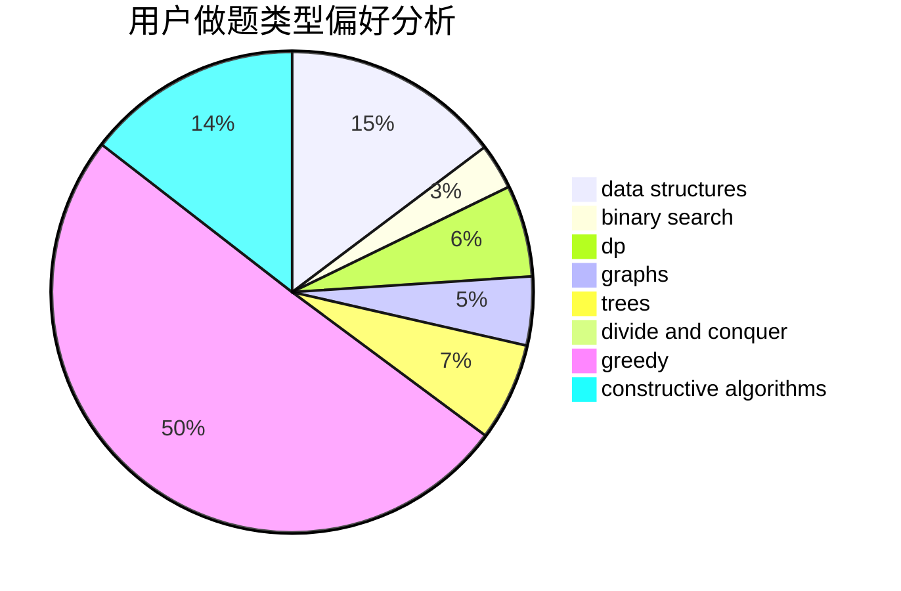
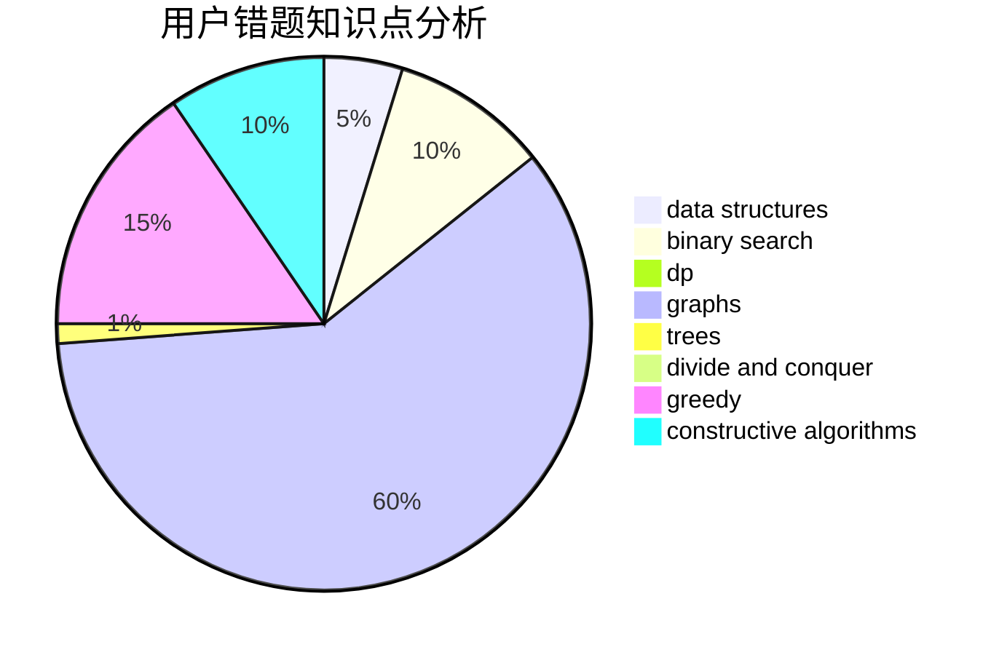

# lndjy

<!-- tabs:start -->

#### **用户提交结果分析**

#### **用户做题类型偏好分析**

#### **用户错题知识点分析**

<!-- tabs:end -->
# 推荐题目
[1343E](https://codeforces.com/contest/1343/problem/E)		brute force,
                        graphs,
                        greedy,
                        shortest paths,
                        sortings		  
[755D](https://codeforces.com/contest/755/problem/D)		data structures		  
[653D](https://codeforces.com/contest/653/problem/D)		binary search,
                        flows,
                        graphs		  
[116A](https://codeforces.com/contest/116/problem/A)		implementation		  
[523A](https://codeforces.com/contest/523/problem/A)		*special problem,
                        implementation		  
[729C](https://codeforces.com/contest/729/problem/C)		binary search,
                        greedy,
                        sortings		  
[731B](https://codeforces.com/contest/731/problem/B)		constructive algorithms,
                        greedy		  
[33C](https://codeforces.com/contest/33/problem/C)		greedy		  
[1076F](https://codeforces.com/contest/1076/problem/F)		dp,
                        greedy		  
[1307A](https://codeforces.com/contest/1307/problem/A)		greedy,
                        implementation		  
