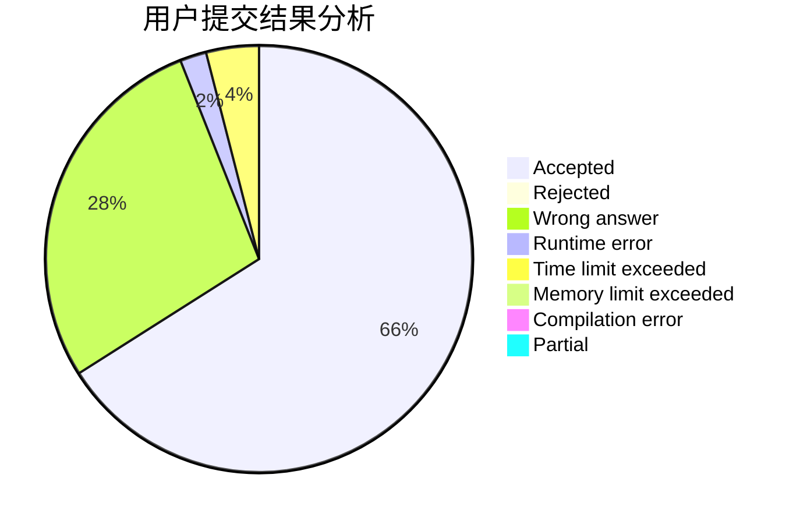
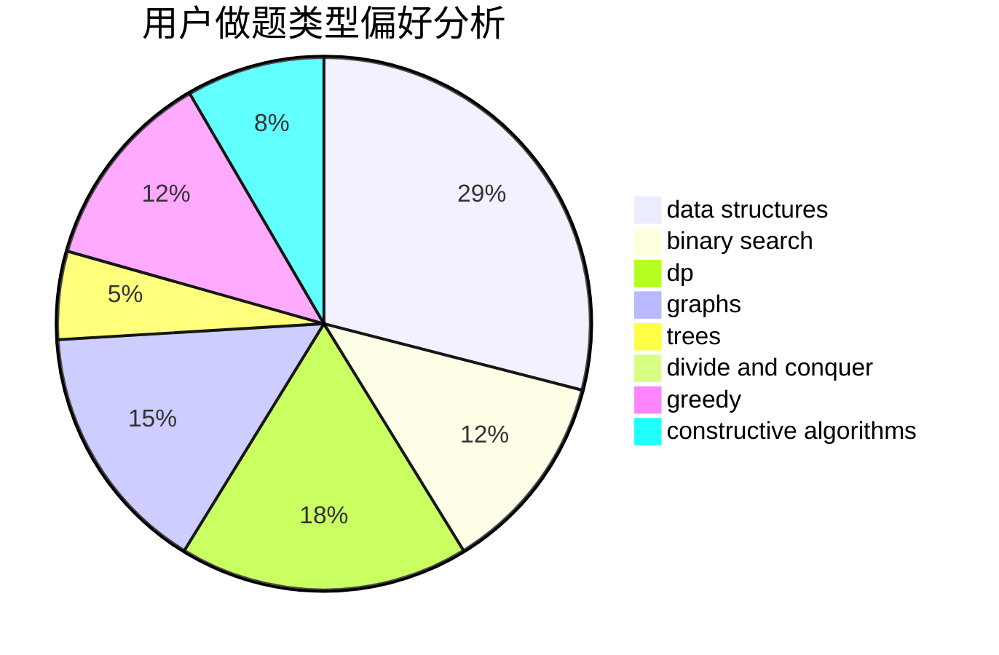

# loceaner

<!-- tabs:start -->

#### **用户提交结果分析**

#### **用户做题类型偏好分析**

#### **用户错题知识点分析**

<!-- tabs:end -->
# 推荐题目
[1250I](https://codeforces.com/contest/1250/problem/I)		binary search,
                        brute force,
                        greedy,
                        shortest paths		  
[906A](https://codeforces.com/contest/906/problem/A)		implementation,
                        strings		  
[431D](https://codeforces.com/contest/431/problem/D)		binary search,
                        bitmasks,
                        combinatorics,
                        dp,
                        math		  
[69A](https://codeforces.com/contest/69/problem/A)		implementation,
                        math		  
[1046H](https://codeforces.com/contest/1046/problem/H)		dsu,graphs,sortings,trees		  
[1431B](https://codeforces.com/contest/1431/problem/B)		*special problem,
                        implementation,
                        two pointers		  
[931A](https://codeforces.com/contest/931/problem/A)		brute force,
                        greedy,
                        implementation,
                        math		  
[98B](https://codeforces.com/contest/98/problem/B)		implementation,
                        probabilities,
                        trees		  
[300B](https://codeforces.com/contest/300/problem/B)		brute force,
                        dfs and similar,
                        graphs		  
[707E](https://codeforces.com/contest/707/problem/E)		data structures		  
