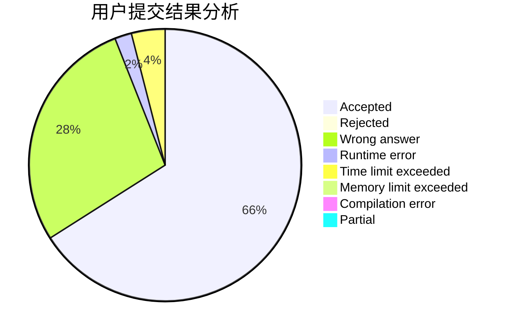
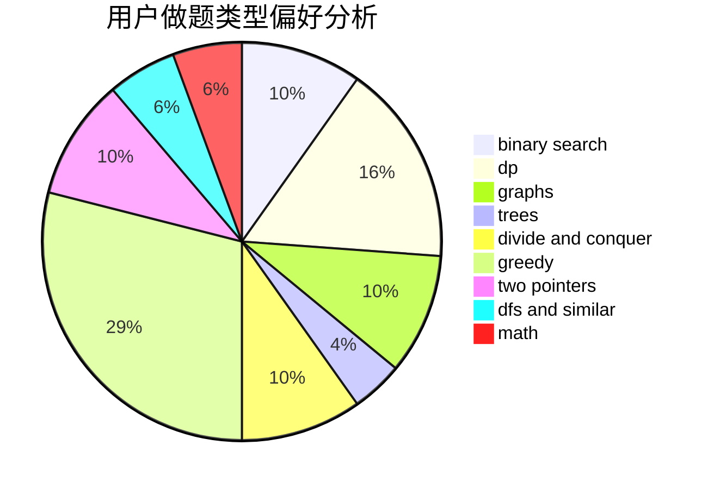

# loceaner

<!-- tabs:start -->

#### **用户提交结果分析**

#### **用户做题类型偏好分析**

<!-- tabs:end -->
# 推荐题目
[1250I](https://codeforces.com/contest/1250/problem/I)
[906A](https://codeforces.com/contest/906/problem/A)
[431D](https://codeforces.com/contest/431/problem/D)
[69A](https://codeforces.com/contest/69/problem/A)
[1046H](https://codeforces.com/contest/1046/problem/H)
[1431B](https://codeforces.com/contest/1431/problem/B)
[931A](https://codeforces.com/contest/931/problem/A)
[98B](https://codeforces.com/contest/98/problem/B)
[300B](https://codeforces.com/contest/300/problem/B)
[707E](https://codeforces.com/contest/707/problem/E)
