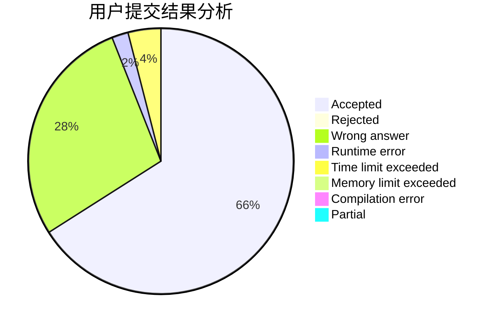
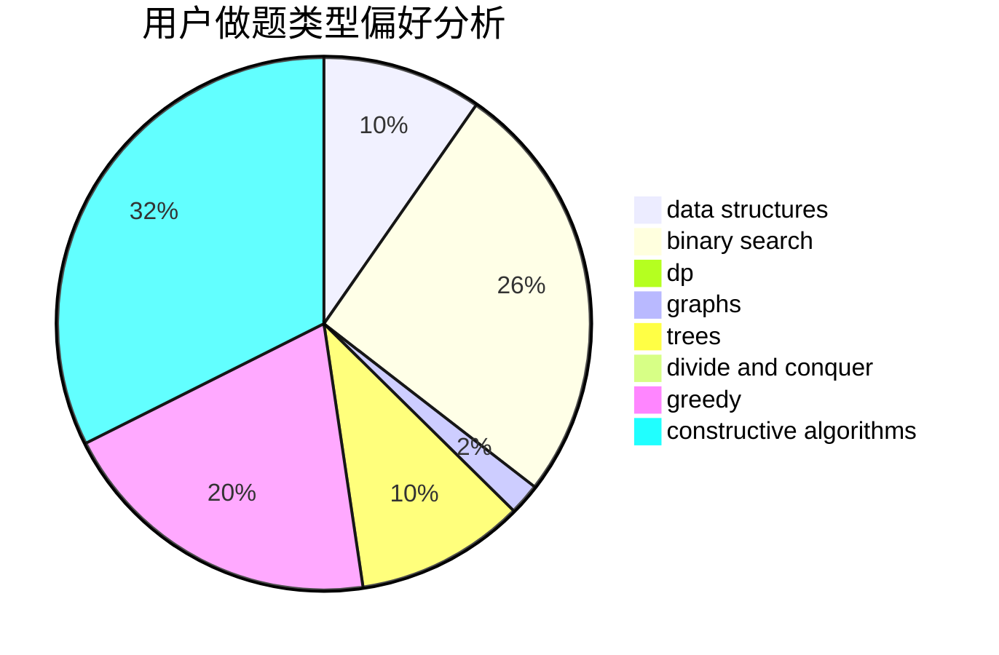

# loceaner

<!-- tabs:start -->

#### **用户提交结果分析**

#### **用户做题类型偏好分析**

#### **用户错题知识点分析**

<!-- tabs:end -->
# 推荐题目
[1246A](https://codeforces.com/contest/1246/problem/A)		dsu,graphs,sortings,trees		  
[886F](https://codeforces.com/contest/886/problem/F)		geometry		  
[403C](https://codeforces.com/contest/403/problem/C)		dsu,graphs,sortings,trees		  
[675A](https://codeforces.com/contest/675/problem/A)		math		  
[1045I](https://codeforces.com/contest/1045/problem/I)		hashing,
                        strings		  
[1423G](https://codeforces.com/contest/1423/problem/G)		data structures		  
[912C](https://codeforces.com/contest/912/problem/C)		brute force,
                        greedy,
                        sortings		  
[975C](https://codeforces.com/contest/975/problem/C)		binary search		  
[286A](https://codeforces.com/contest/286/problem/A)		constructive algorithms,
                        math		  
[685C](https://codeforces.com/contest/685/problem/C)		binary search,
                        math		  
