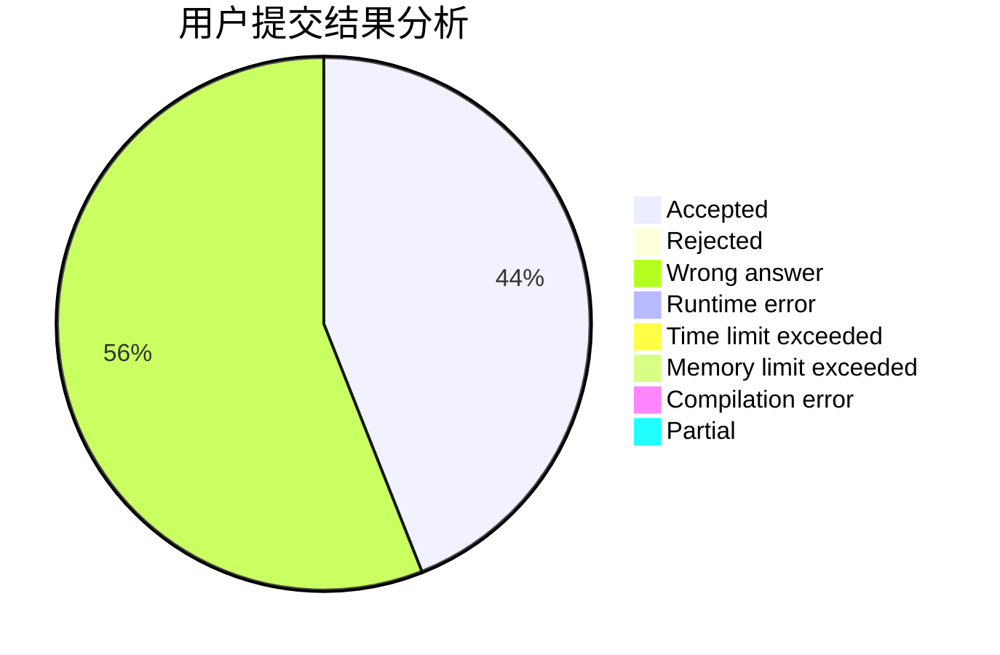
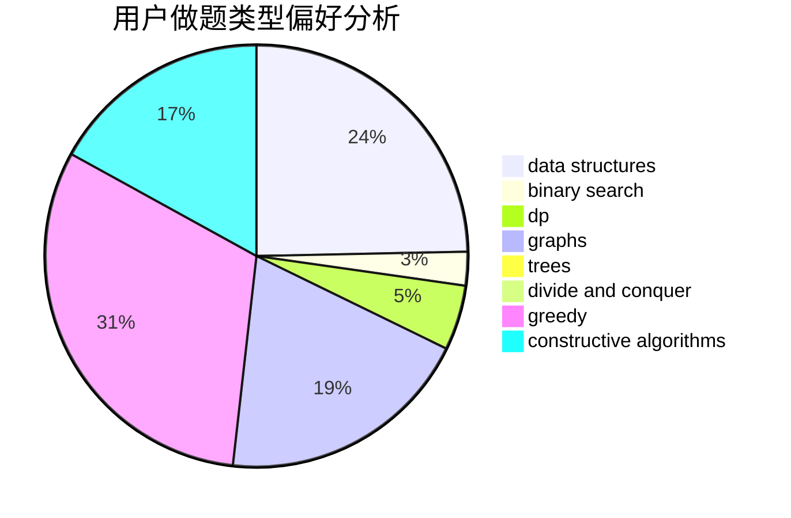
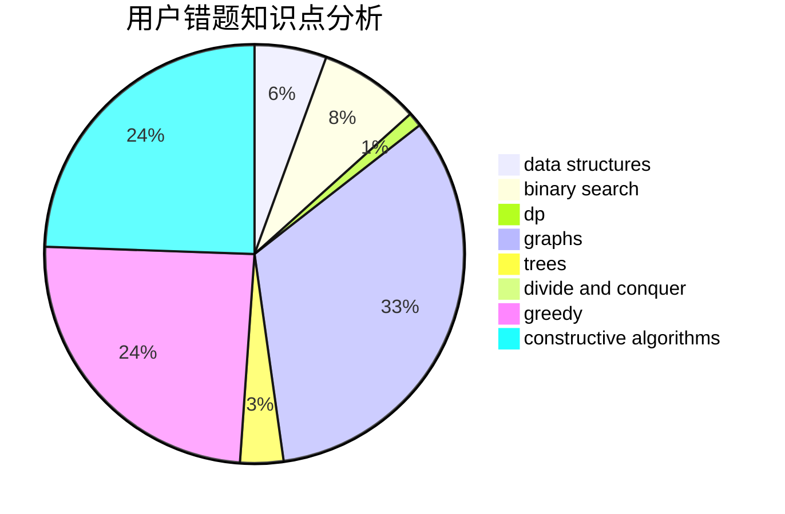

# logicccc

<!-- tabs:start -->

#### **用户提交结果分析**

#### **用户做题类型偏好分析**

#### **用户错题知识点分析**

<!-- tabs:end -->
# 推荐题目
[1470E](https://codeforces.com/contest/1470/problem/E)		binary search,
                        combinatorics,
                        data structures,
                        dp,
                        graphs,
                        implementation,
                        two pointers		  
[1243A](https://codeforces.com/contest/1243/problem/A)		implementation		  
[343A](https://codeforces.com/contest/343/problem/A)		math,
                        number theory		  
[379D](https://codeforces.com/contest/379/problem/D)		bitmasks,
                        brute force,
                        dp		  
[954C](https://codeforces.com/contest/954/problem/C)		implementation		  
[549E](https://codeforces.com/contest/549/problem/E)		geometry,
                        math		  
[660E](https://codeforces.com/contest/660/problem/E)		combinatorics		  
[140C](https://codeforces.com/contest/140/problem/C)		binary search,
                        data structures,
                        greedy		  
[1164I](https://codeforces.com/contest/1164/problem/I)		dsu,graphs,sortings,trees		  
[1151B](https://codeforces.com/contest/1151/problem/B)		bitmasks,
                        brute force,
                        constructive algorithms,
                        dp		  
