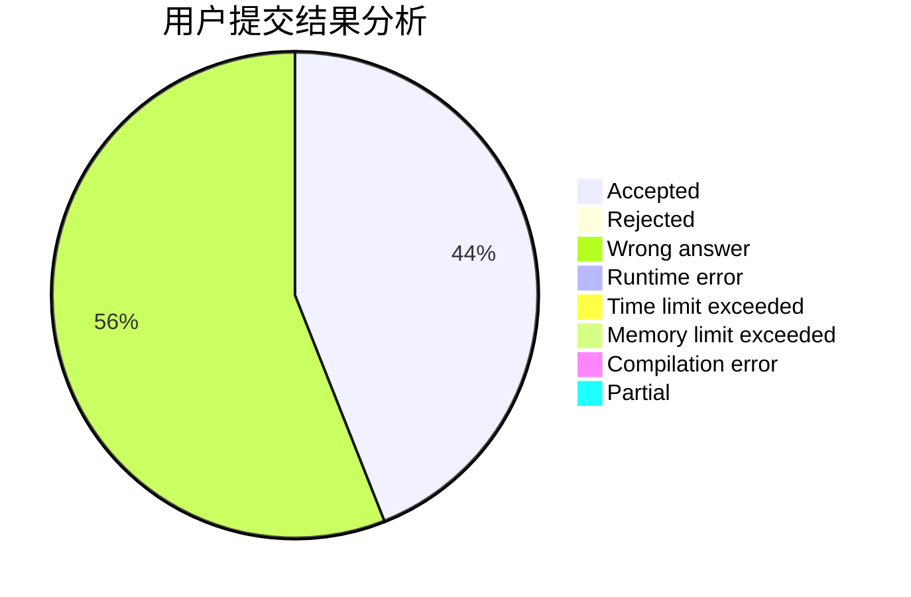
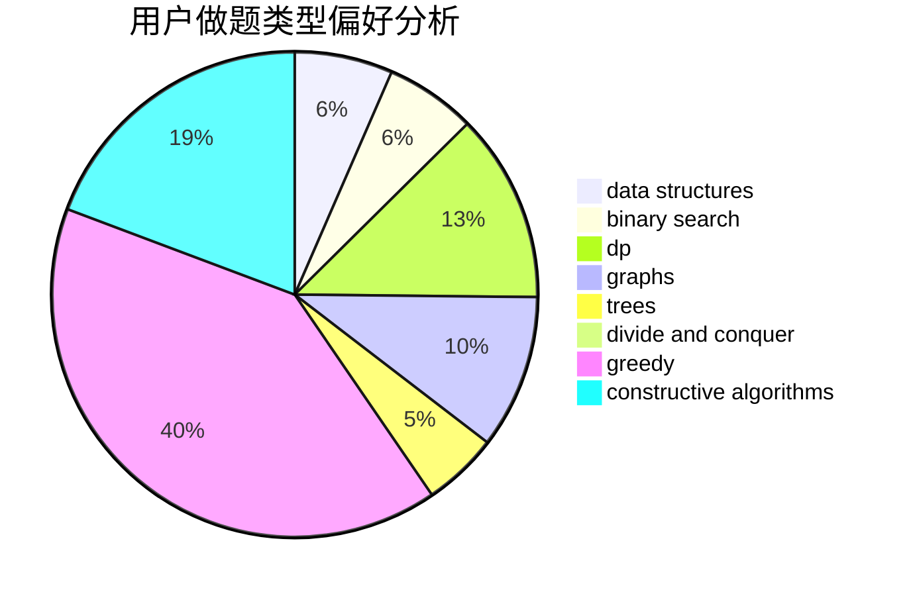
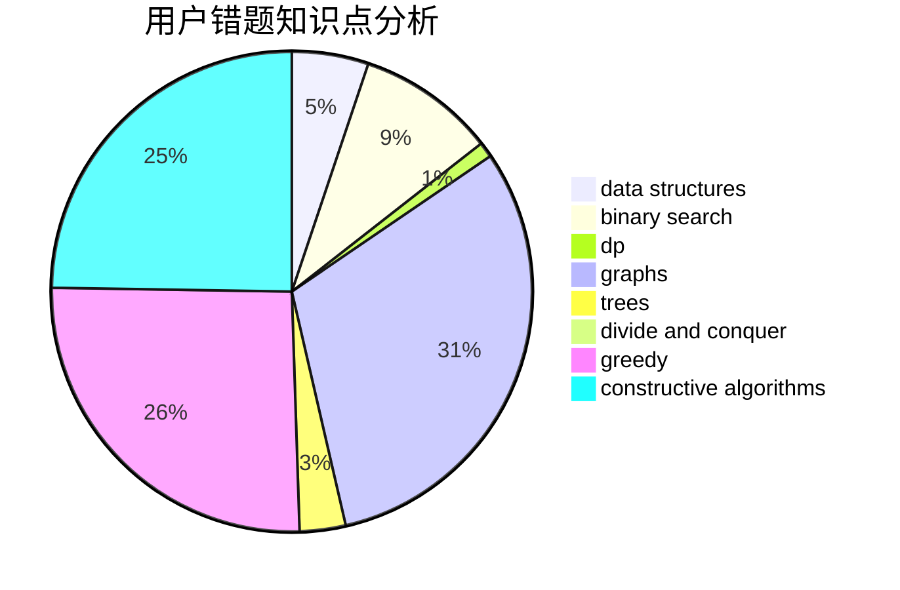

# logicccc

<!-- tabs:start -->

#### **用户提交结果分析**

#### **用户做题类型偏好分析**

#### **用户错题知识点分析**

<!-- tabs:end -->
# 推荐题目
[1463D](https://codeforces.com/contest/1463/problem/D)		binary search,
                        constructive algorithms,
                        greedy,
                        two pointers		  
[1238B](https://codeforces.com/contest/1238/problem/B)		greedy,
                        sortings		  
[316E2](https://codeforces.com/contest/316E/problem/2)		data structures,
                        math		  
[352E](https://codeforces.com/contest/352/problem/E)		dsu,graphs,sortings,trees		  
[932C](https://codeforces.com/contest/932/problem/C)		brute force,
                        constructive algorithms		  
[525B](https://codeforces.com/contest/525/problem/B)		constructive algorithms,
                        greedy,
                        math,
                        strings		  
[630J](https://codeforces.com/contest/630/problem/J)		math,
                        number theory		  
[1400D](https://codeforces.com/contest/1400/problem/D)		brute force,
                        combinatorics,
                        data structures,
                        math,
                        two pointers		  
[1162B](https://codeforces.com/contest/1162/problem/B)		brute force,
                        greedy		  
[1149D](https://codeforces.com/contest/1149/problem/D)		brute force,
                        dp,
                        graphs,
                        greedy		  
