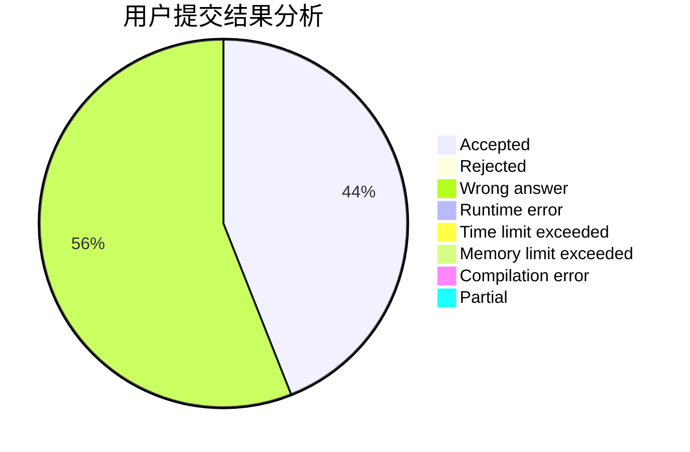
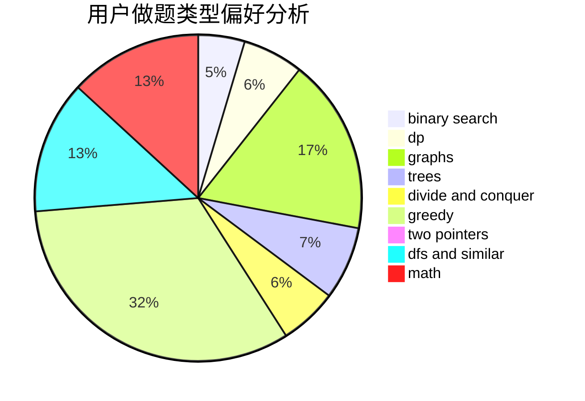

# logicccc

<!-- tabs:start -->

#### **用户提交结果分析**

#### **用户做题类型偏好分析**

<!-- tabs:end -->
# 推荐题目
[1470E](https://codeforces.com/contest/1470/problem/E)
[1243A](https://codeforces.com/contest/1243/problem/A)
[343A](https://codeforces.com/contest/343/problem/A)
[379D](https://codeforces.com/contest/379/problem/D)
[954C](https://codeforces.com/contest/954/problem/C)
[549E](https://codeforces.com/contest/549/problem/E)
[660E](https://codeforces.com/contest/660/problem/E)
[140C](https://codeforces.com/contest/140/problem/C)
[1164I](https://codeforces.com/contest/1164/problem/I)
[1151B](https://codeforces.com/contest/1151/problem/B)
