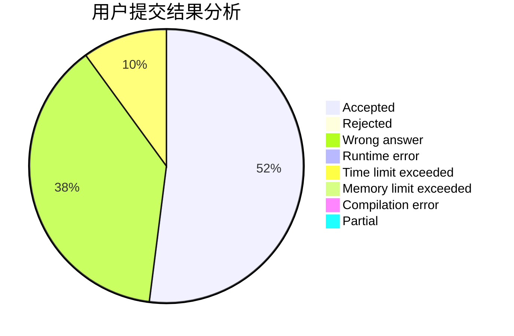
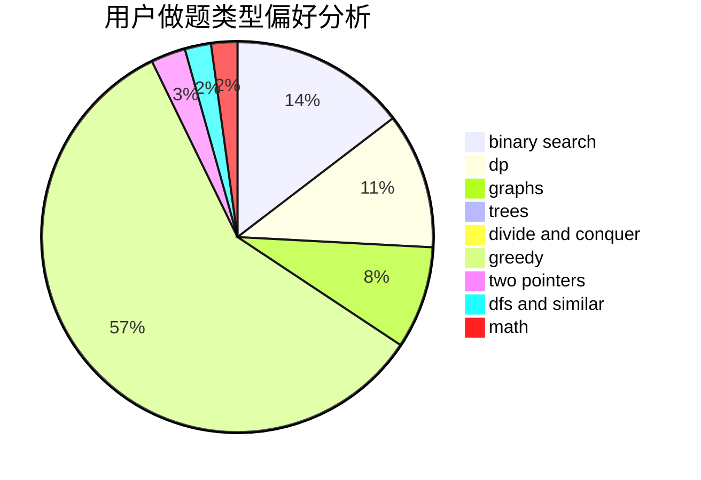

# longlong233

<!-- tabs:start -->

#### **用户提交结果分析**

#### **用户做题类型偏好分析**

<!-- tabs:end -->
# 推荐题目
[23B](https://codeforces.com/contest/23/problem/B)
[776B](https://codeforces.com/contest/776/problem/B)
[722C](https://codeforces.com/contest/722/problem/C)
[771D](https://codeforces.com/contest/771/problem/D)
[1163D](https://codeforces.com/contest/1163/problem/D)
[1428E](https://codeforces.com/contest/1428/problem/E)
[976F](https://codeforces.com/contest/976/problem/F)
[319A](https://codeforces.com/contest/319/problem/A)
[1369F](https://codeforces.com/contest/1369/problem/F)
[282A](https://codeforces.com/contest/282/problem/A)
