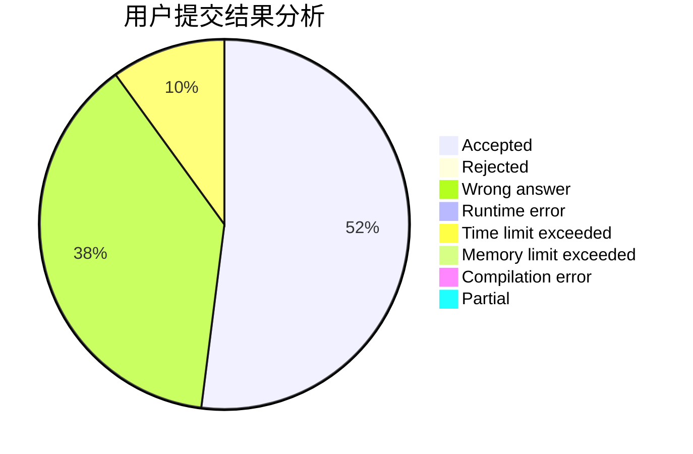
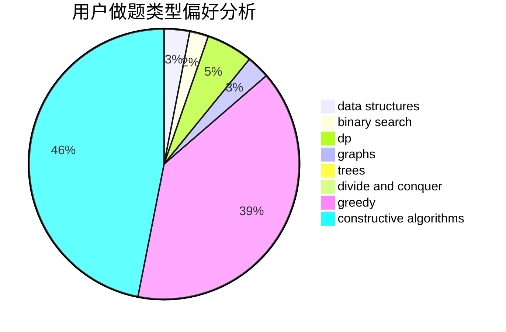

# longlong233

<!-- tabs:start -->

#### **用户提交结果分析**

#### **用户做题类型偏好分析**

#### **用户错题知识点分析**

<!-- tabs:end -->
# 推荐题目
[23B](https://codeforces.com/contest/23/problem/B)		constructive algorithms,
                        graphs,
                        math		  
[776B](https://codeforces.com/contest/776/problem/B)		constructive algorithms,
                        number theory		  
[722C](https://codeforces.com/contest/722/problem/C)		data structures,
                        dsu		  
[771D](https://codeforces.com/contest/771/problem/D)		dp		  
[1163D](https://codeforces.com/contest/1163/problem/D)		dp,
                        strings		  
[1428E](https://codeforces.com/contest/1428/problem/E)		binary search,
                        data structures,
                        greedy,
                        math,
                        sortings		  
[976F](https://codeforces.com/contest/976/problem/F)		flows,
                        graphs		  
[319A](https://codeforces.com/contest/319/problem/A)		combinatorics,
                        math		  
[1369F](https://codeforces.com/contest/1369/problem/F)		dfs and similar,
                        dp,
                        games		  
[282A](https://codeforces.com/contest/282/problem/A)		implementation		  
