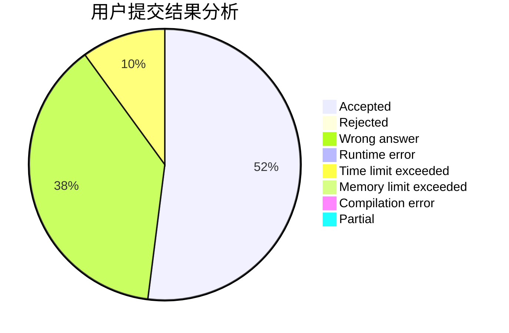
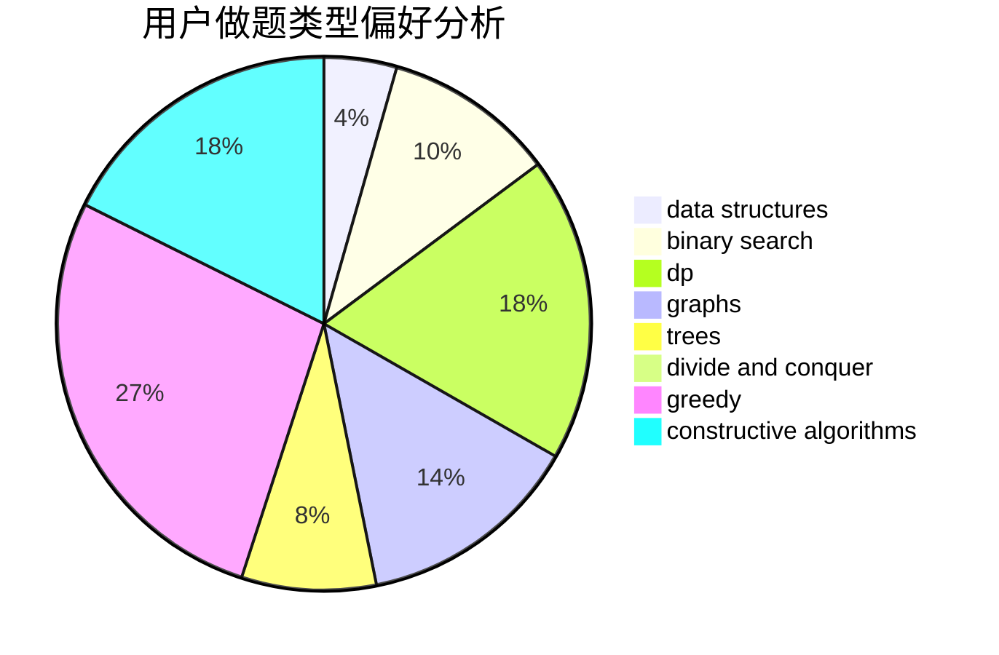

# longlong233

<!-- tabs:start -->

#### **用户提交结果分析**

#### **用户做题类型偏好分析**

#### **用户错题知识点分析**

<!-- tabs:end -->
# 推荐题目
[21D](https://codeforces.com/contest/21/problem/D)		bitmasks,
                        graph matchings,
                        graphs		  
[756D](https://codeforces.com/contest/756/problem/D)		brute force,
                        combinatorics,
                        dp,
                        string suffix structures		  
[703B](https://codeforces.com/contest/703/problem/B)		implementation,
                        math		  
[750H](https://codeforces.com/contest/750/problem/H)		dfs and similar,
                        dsu,
                        graphs,
                        interactive		  
[1161A](https://codeforces.com/contest/1161/problem/A)		dsu,graphs,sortings,trees		  
[1421B](https://codeforces.com/contest/1421/problem/B)		constructive algorithms,
                        implementation		  
[954I](https://codeforces.com/contest/954/problem/I)		fft,
                        math		  
[300C](https://codeforces.com/contest/300/problem/C)		brute force,
                        combinatorics		  
[1362A](https://codeforces.com/contest/1362/problem/A)		implementation		  
[266B](https://codeforces.com/contest/266/problem/B)		constructive algorithms,
                        graph matchings,
                        implementation,
                        shortest paths		  
