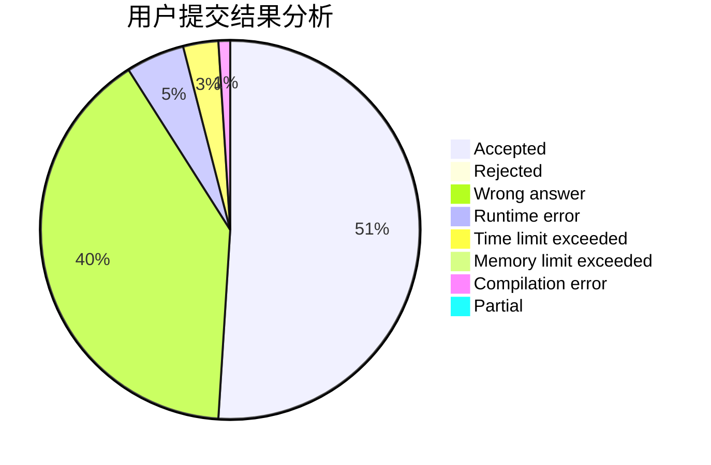
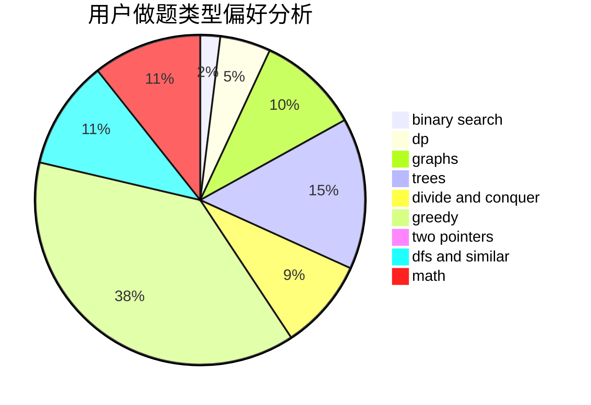

# longlongyuht

<!-- tabs:start -->

#### **用户提交结果分析**

#### **用户做题类型偏好分析**

<!-- tabs:end -->
# 推荐题目
[1397C](https://codeforces.com/contest/1397/problem/C)
[1067B](https://codeforces.com/contest/1067/problem/B)
[429A](https://codeforces.com/contest/429/problem/A)
[592A](https://codeforces.com/contest/592/problem/A)
[1316B](https://codeforces.com/contest/1316/problem/B)
[279B](https://codeforces.com/contest/279/problem/B)
[845D](https://codeforces.com/contest/845/problem/D)
[603B](https://codeforces.com/contest/603/problem/B)
[574C](https://codeforces.com/contest/574/problem/C)
[415A](https://codeforces.com/contest/415/problem/A)
