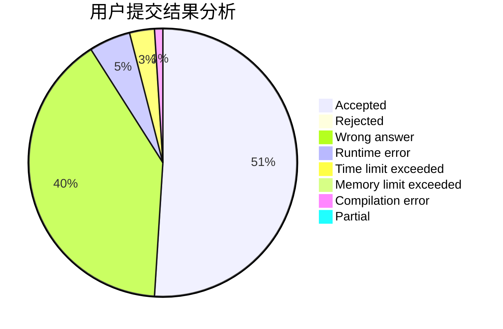
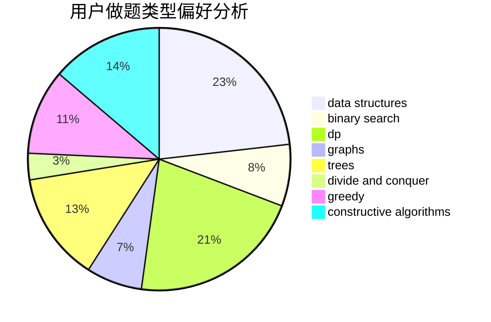

# longlongyuht

<!-- tabs:start -->

#### **用户提交结果分析**

#### **用户做题类型偏好分析**

#### **用户错题知识点分析**

<!-- tabs:end -->
# 推荐题目
[1397C](https://codeforces.com/contest/1397/problem/C)		dsu,graphs,sortings,trees		  
[1067B](https://codeforces.com/contest/1067/problem/B)		dfs and similar,
                        graphs,
                        shortest paths		  
[429A](https://codeforces.com/contest/429/problem/A)		dfs and similar,
                        trees		  
[592A](https://codeforces.com/contest/592/problem/A)		implementation		  
[1316B](https://codeforces.com/contest/1316/problem/B)		brute force,
                        constructive algorithms,
                        implementation,
                        sortings,
                        strings		  
[279B](https://codeforces.com/contest/279/problem/B)		binary search,
                        brute force,
                        implementation,
                        two pointers		  
[845D](https://codeforces.com/contest/845/problem/D)		data structures,
                        dp,
                        greedy		  
[603B](https://codeforces.com/contest/603/problem/B)		combinatorics,
                        dfs and similar,
                        dsu,
                        math,
                        number theory		  
[574C](https://codeforces.com/contest/574/problem/C)		dsu,graphs,sortings,trees		  
[415A](https://codeforces.com/contest/415/problem/A)		implementation		  
