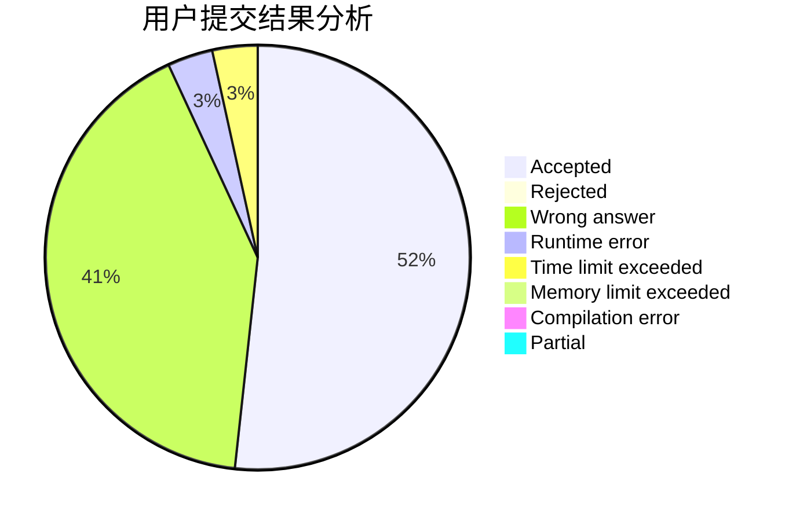
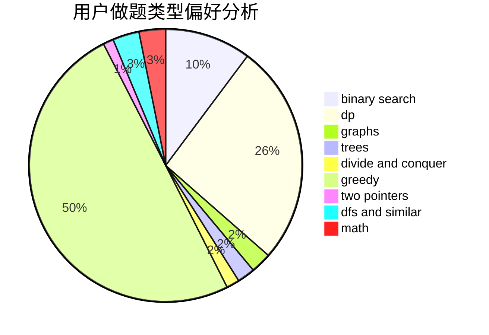

# loriouls

<!-- tabs:start -->

#### **用户提交结果分析**

#### **用户做题类型偏好分析**

<!-- tabs:end -->
# 推荐题目
[993B](https://codeforces.com/contest/993/problem/B)
[394C](https://codeforces.com/contest/394/problem/C)
[1007A](https://codeforces.com/contest/1007/problem/A)
[946D](https://codeforces.com/contest/946/problem/D)
[900D](https://codeforces.com/contest/900/problem/D)
[25E](https://codeforces.com/contest/25/problem/E)
[907B](https://codeforces.com/contest/907/problem/B)
[720D](https://codeforces.com/contest/720/problem/D)
[706A](https://codeforces.com/contest/706/problem/A)
[14D](https://codeforces.com/contest/14/problem/D)
