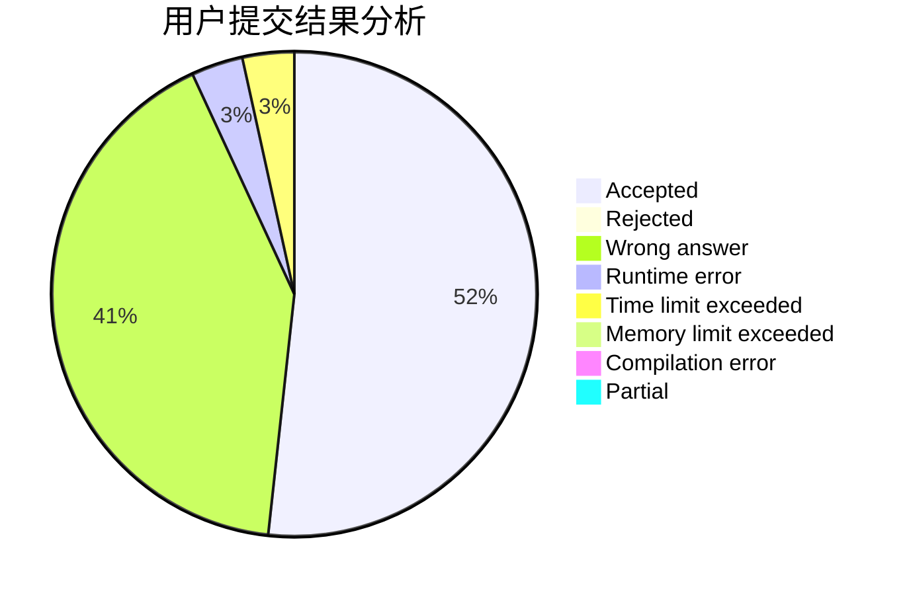
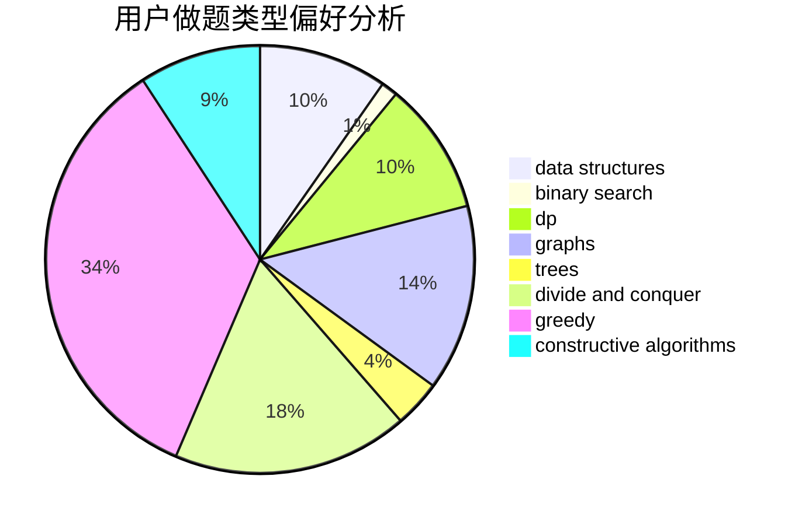
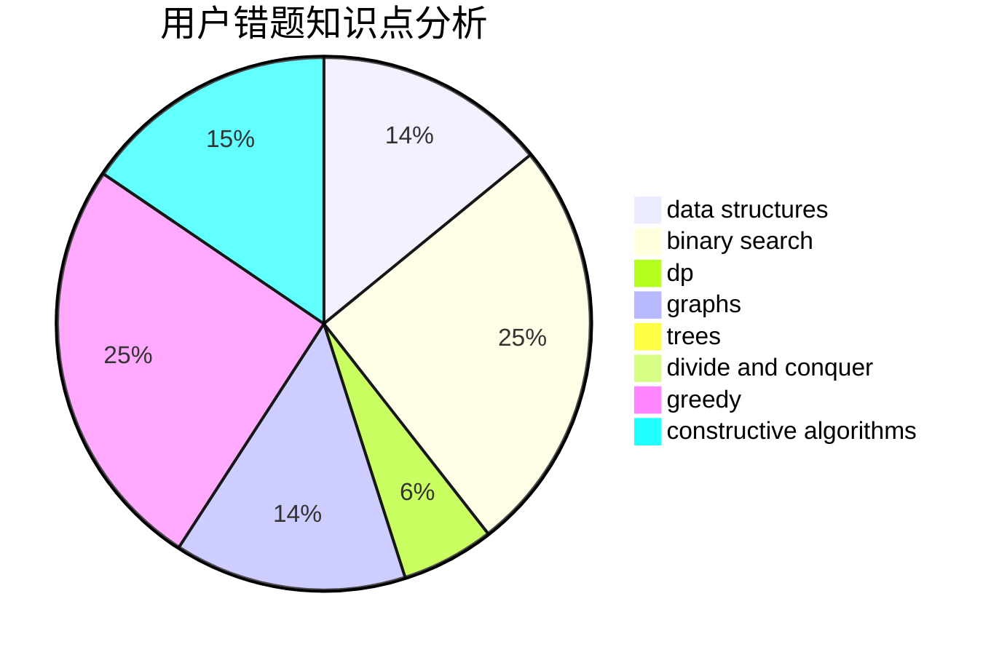

# loriouls

<!-- tabs:start -->

#### **用户提交结果分析**

#### **用户做题类型偏好分析**

#### **用户错题知识点分析**

<!-- tabs:end -->
# 推荐题目
[979B](https://codeforces.com/contest/979/problem/B)		greedy		  
[366C](https://codeforces.com/contest/366/problem/C)		dp		  
[1006D](https://codeforces.com/contest/1006/problem/D)		implementation		  
[922D](https://codeforces.com/contest/922/problem/D)		greedy,
                        sortings		  
[883E](https://codeforces.com/contest/883/problem/E)		implementation,
                        strings		  
[238C](https://codeforces.com/contest/238/problem/C)		dfs and similar,
                        dp,
                        greedy,
                        trees		  
[887F](https://codeforces.com/contest/887/problem/F)		greedy,
                        sortings		  
[702A](https://codeforces.com/contest/702/problem/A)		dp,
                        greedy,
                        implementation		  
[682A](https://codeforces.com/contest/682/problem/A)		constructive algorithms,
                        math,
                        number theory		  
[1491G](https://codeforces.com/contest/1491/problem/G)		constructive algorithms,
                        graphs,
                        math		  
