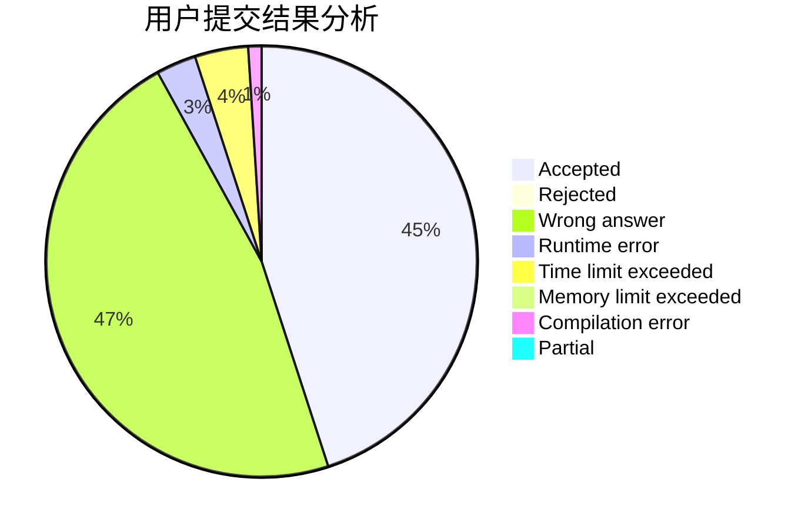
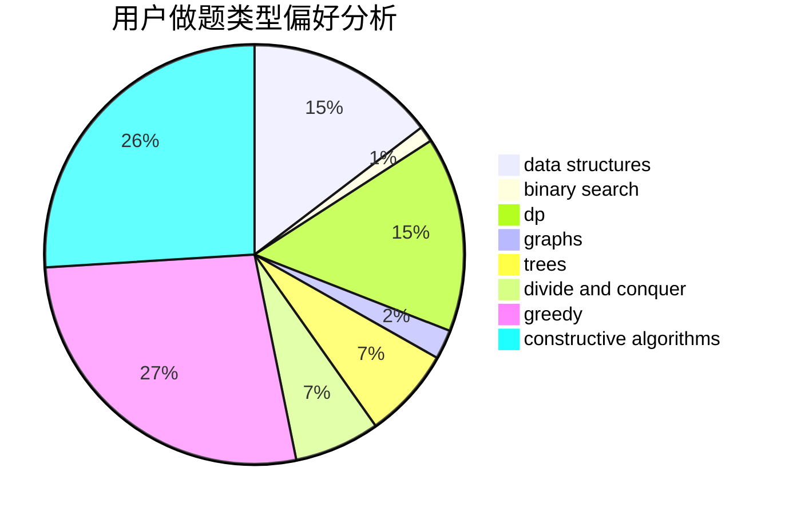

# lotato

<!-- tabs:start -->

#### **用户提交结果分析**

#### **用户做题类型偏好分析**

#### **用户错题知识点分析**

<!-- tabs:end -->
# 推荐题目
[1238C](https://codeforces.com/contest/1238/problem/C)		dp,
                        greedy,
                        math		  
[1501A](https://codeforces.com/contest/1501/problem/A)		implementation		  
[495B](https://codeforces.com/contest/495/problem/B)		math,
                        number theory		  
[158A](https://codeforces.com/contest/158/problem/A)		*special problem,
                        implementation		  
[558A](https://codeforces.com/contest/558/problem/A)		brute force,
                        implementation,
                        sortings		  
[1113A](https://codeforces.com/contest/1113/problem/A)		dp,
                        greedy,
                        math		  
[758B](https://codeforces.com/contest/758/problem/B)		brute force,
                        implementation,
                        number theory		  
[688D](https://codeforces.com/contest/688/problem/D)		dsu,graphs,sortings,trees		  
[1154E](https://codeforces.com/contest/1154/problem/E)		data structures,
                        implementation,
                        sortings		  
[620A](https://codeforces.com/contest/620/problem/A)		implementation,
                        math		  
