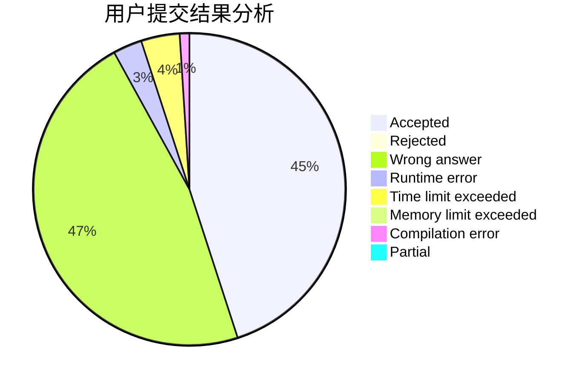
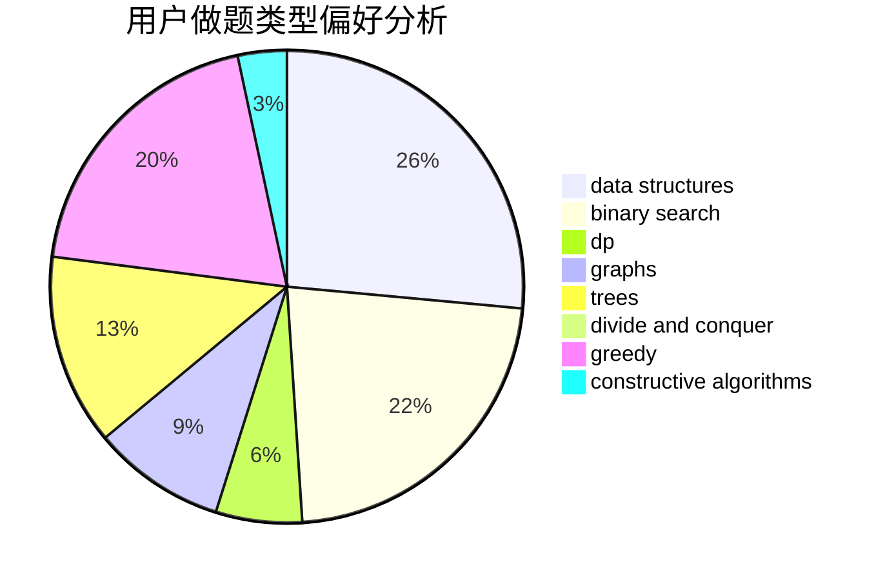

# lotato

<!-- tabs:start -->

#### **用户提交结果分析**

#### **用户做题类型偏好分析**

#### **用户错题知识点分析**

<!-- tabs:end -->
# 推荐题目
[122B](https://codeforces.com/contest/122/problem/B)		brute force,
                        implementation		  
[1493A](https://codeforces.com/contest/1493/problem/A)		constructive algorithms,
                        greedy		  
[476B](https://codeforces.com/contest/476/problem/B)		bitmasks,
                        brute force,
                        combinatorics,
                        dp,
                        math,
                        probabilities		  
[1506D](https://codeforces.com/contest/1506/problem/D)		constructive algorithms,
                        data structures,
                        greedy		  
[535C](https://codeforces.com/contest/535/problem/C)		binary search,
                        greedy,
                        math		  
[1111B](https://codeforces.com/contest/1111/problem/B)		brute force,
                        implementation,
                        math		  
[736D](https://codeforces.com/contest/736/problem/D)		math,
                        matrices		  
[666E](https://codeforces.com/contest/666/problem/E)		data structures,
                        string suffix structures		  
[1152E](https://codeforces.com/contest/1152/problem/E)		constructive algorithms,
                        dfs and similar,
                        graphs		  
[600E](https://codeforces.com/contest/600/problem/E)		data structures,
                        dfs and similar,
                        dsu,
                        trees		  
