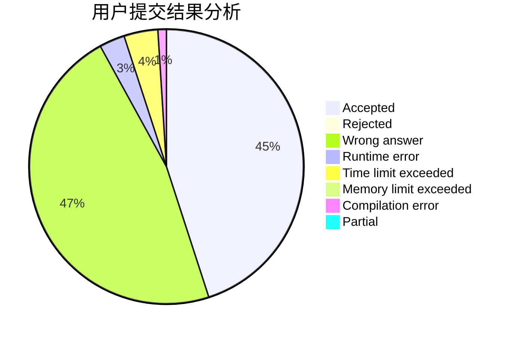
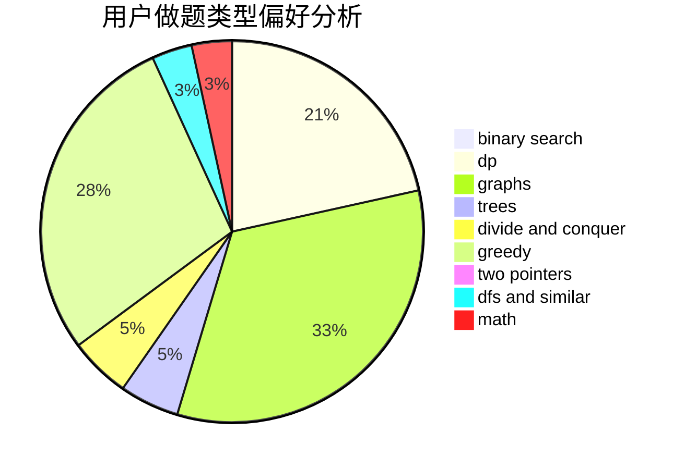

# lotato

<!-- tabs:start -->

#### **用户提交结果分析**

#### **用户做题类型偏好分析**

<!-- tabs:end -->
# 推荐题目
[1238C](https://codeforces.com/contest/1238/problem/C)
[1501A](https://codeforces.com/contest/1501/problem/A)
[495B](https://codeforces.com/contest/495/problem/B)
[158A](https://codeforces.com/contest/158/problem/A)
[558A](https://codeforces.com/contest/558/problem/A)
[1113A](https://codeforces.com/contest/1113/problem/A)
[758B](https://codeforces.com/contest/758/problem/B)
[688D](https://codeforces.com/contest/688/problem/D)
[1154E](https://codeforces.com/contest/1154/problem/E)
[620A](https://codeforces.com/contest/620/problem/A)
